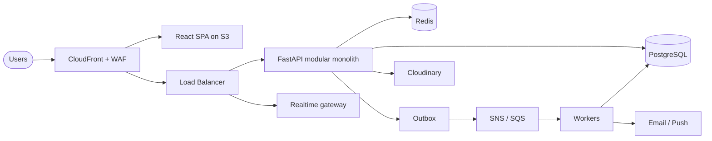

<div align="center">


### 📚 A community platform where books circulate instead of gathering dust

[](https://github.com/YOUR_USERNAME/bookbridge/actions)
[](LICENSE)
[](https://github.com/YOUR_USERNAME/bookbridge/commits/main)
[](https://github.com/YOUR_USERNAME/bookbridge)


</div>

---

## ✨ What is BookBridge?

BookBridge helps people **lend, borrow, exchange and donate physical books** within trusted local communities.
It is **not a marketplace**: no money changes hands for books. Think *Airbnb's trust model + Goodreads' reading identity + Discord's community.*

> 🎯 **Vision:** India's largest community-driven book-sharing network.

## 🚀 Features

| | Feature | Highlights |
|---|---|---|
| 🔎 | **Smart search** | Title, author, ISBN, genre, language, college, city. Distance and condition filters |
| 🤝 | **Exchange workflow** | Request → accept → pickup → borrow → return → review, with reminders |
| 💬 | **Gated chat** | Chat opens only after an exchange exists. Text, images, read receipts |
| 🛡️ | **Trust score** | Based on returns, reviews, cancellations and response time |
| 📖 | **Book Journey** | Every physical copy keeps its own history, quotes and lessons |
| ⭐ | **Wishlist alerts** | Get notified when a wanted book becomes available |
| 👥 | **Reading clubs** | Schedules, polls, discussions, events |
| 📊 | **Impact dashboard** | Books read, money saved, CO₂ avoided, reading streak |

## 🏗️ Architecture



**Key ideas:** modular monolith with event-driven boundaries · Postgres as the source of truth · transactional outbox · cursor pagination · idempotent APIs · infrastructure as code.

## ⚡ Quick Start

```bash
git clone https://github.com/YOUR_USERNAME/bookbridge.git
cd bookbridge
cp .env.example .env          # add your local values
docker compose up --build     # api, worker, postgres, redis
```

| Service | URL |
|---|---|
| Web app | http://localhost:5173 |
| API docs (Swagger) | http://localhost:8000/docs |

> 📝 Commands assume the repo layout described in the docs. Adjust to your setup.

## 🗂️ Project Structure

```text
bookbridge/
├── backend/    # FastAPI: modules/ (identity, catalog, exchange, chat…), core/, tasks/
├── web/        # React + TS + Tailwind: features/, shared/, app/
├── infra/      # Terraform: network, ecs, rds, redis, monitoring
├── docs/       # PRD, HLD, DB schema, API spec, deployment
└── .github/    # CI/CD workflows
```

## 📚 Documentation

| Doc | Description |
|---|---|
| 📄 PRD | Vision, personas, requirements, roadmap |
| 🧭 High Level Design | Components, data flow, request flows |
| 🗄️ Database Schema | 66 tables with ER diagrams |
| 🔌 REST API | ~135 endpoints, errors, pagination |
| 🎨 Frontend Architecture | Routing, state, auth, wireframes |
| ☁️ Deployment | AWS, Docker, CI/CD, DR, cost |

## 🗺️ Roadmap

- [x] Product requirements and architecture
- [ ] **MVP:** auth, listings, search, exchange workflow, chat, notifications, trust v1
- [ ] Reading clubs and Book Journey
- [ ] Semantic search and recommendations
- [ ] Barcode scan, QR pickup, mobile app
- [ ] Graph-based chain exchanges (A → B → C)

## 🤝 Contributing

1. Fork the repo and create a branch: `git checkout -b feat/your-feature`
2. Run `make lint test` before committing
3. Open a pull request with a clear description

## 📜 License

Released under the [MIT License](LICENSE).

<div align="center">

**Made with ❤️ for readers everywhere** · ⭐ Star the repo if you like the idea

</div>
