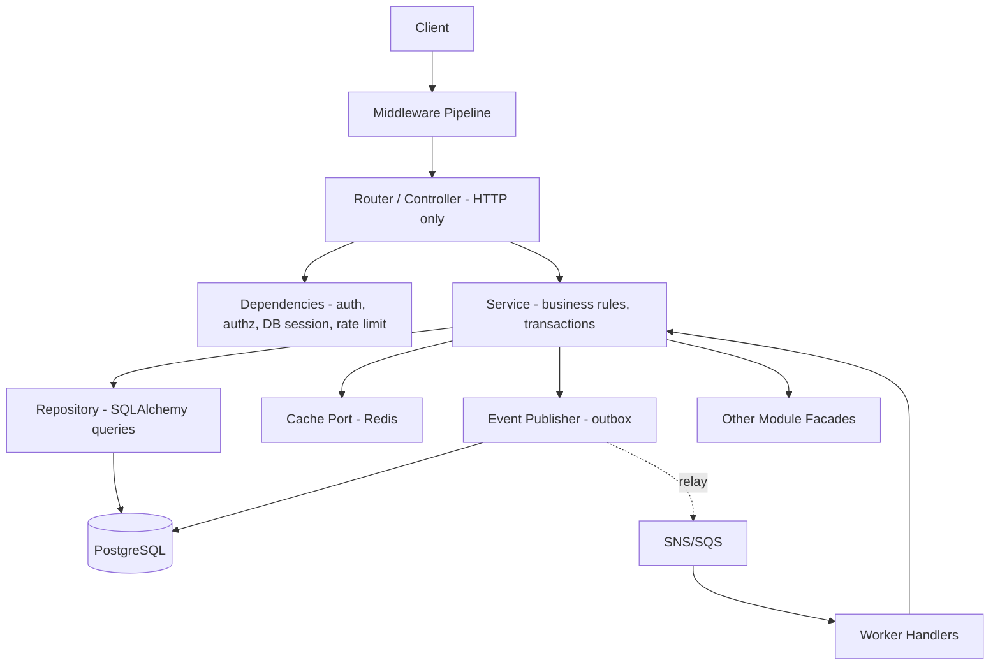
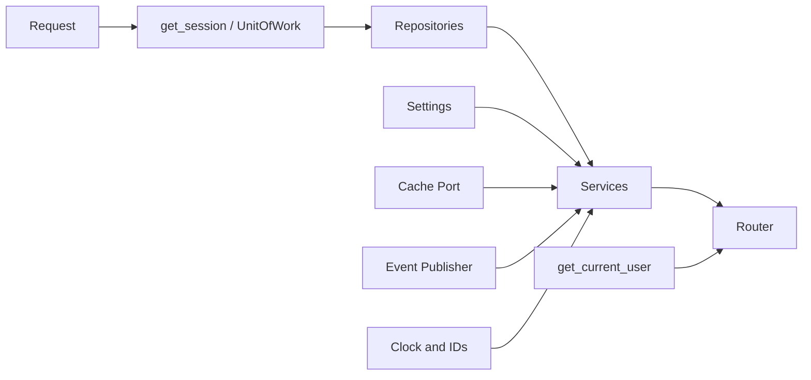
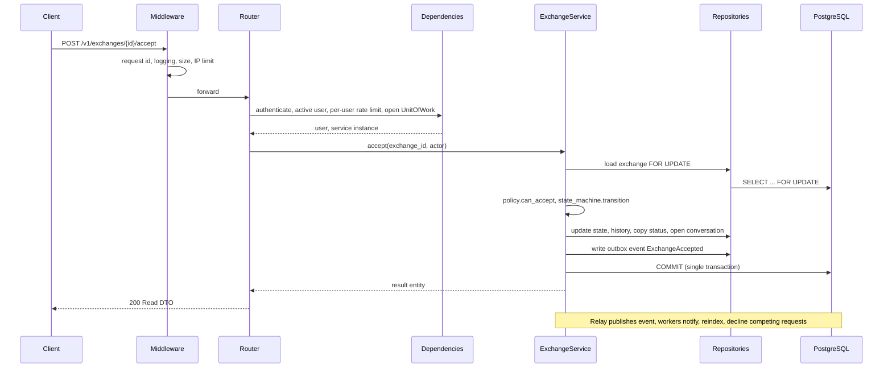

# BookBridge — Backend Architecture

**Author:** Senior Backend Engineer · **Inputs:** PRD, HLD, DB Schema · **Stack:** FastAPI (async), SQLAlchemy 2 (async), PostgreSQL, Redis, JWT.

---

## 1. Architectural Style

**Modular monolith with layered modules and a shared kernel.** One deployable codebase, three entrypoints (API, Worker, Realtime) from the same image, per the HLD.

| Principle | Decision | Why |
| --- | --- | --- |
| Vertical slicing | Code is organised **by business module** (`exchange/`, `catalog/`), not by technical layer (`controllers/`, `models/`) | A feature change touches one folder; ownership and later extraction to a service are trivial. Layer-first folders force every PR to touch 5 directories |
| Layering inside a module | Router → Service → Repository → DB | Each layer has one reason to change (HTTP contract, business rules, persistence) |
| Dependency direction | Inward only: `api → service → repository`; services never import routers; modules never import another module's repository or models | Prevents spaghetti and cross-module table access (DB schema rule) |
| Cross-module communication | Public **facade** interface for synchronous reads; **domain events** (outbox) for side effects | Decoupling and extractability |
| Async everywhere | Async routes, async SQLAlchemy, async Redis | High concurrency per container for I/O-bound work |



## 2. Folder Structure

```text
bookbridge-backend/
├── pyproject.toml                 # deps, ruff, mypy, import-linter contracts
├── Dockerfile                     # one image, multi-stage, non-root
├── docker-compose.yml             # local: api, worker, postgres, redis, opensearch
├── alembic/                       # migrations (versions/, env.py)
├── configs/                       # base.yaml, dev.yaml, staging.yaml, prod.yaml (non-secret)
├── scripts/                       # seed data, reindex, backfill, outbox replay
├── tests/
│   ├── unit/                      # services with fake repositories
│   ├── integration/               # real Postgres/Redis via testcontainers
│   ├── contract/                  # OpenAPI schema snapshot tests
│   └── e2e/                       # exchange workflow scenarios
└── app/
    ├── main.py                    # API app factory: wiring, routers, middleware, handlers
    ├── worker.py                  # worker entrypoint: queue consumers
    ├── scheduler.py               # scheduler entrypoint: periodic jobs
    ├── realtime.py                # WebSocket gateway entrypoint
    │
    ├── core/                      # SHARED KERNEL (no business logic)
    │   ├── config.py              # typed settings (pydantic-settings)
    │   ├── logging.py             # structured logging setup
    │   ├── context.py             # request-scoped context (correlation id, user id)
    │   ├── database.py            # engine, session factory, UnitOfWork
    │   ├── redis.py               # connection pools
    │   ├── security.py            # password hashing, JWT encode/decode, token hashing
    │   ├── exceptions.py          # base AppError hierarchy
    │   ├── error_handlers.py      # exception → HTTP problem response mapping
    │   ├── pagination.py          # cursor encode/decode, Page[T]
    │   ├── cache.py               # cache port, key builder, decorators
    │   ├── rate_limit.py          # token bucket, policies
    │   ├── events.py              # DomainEvent base, EventPublisher, outbox writer
    │   ├── storage.py             # StorageProvider port (Cloudinary adapter)
    │   ├── clock.py / ids.py      # injectable time and UUIDv7 generator (testability)
    │   └── base_repository.py     # generic repository helpers
    │
    ├── api/                       # HTTP COMPOSITION LAYER
    │   ├── deps.py                # shared FastAPI dependencies
    │   ├── middleware/            # request_id, logging, timing, security_headers, cors, body_limit
    │   ├── v1/
    │   │   ├── router.py          # mounts every module router under /v1
    │   │   └── health.py          # /health/live, /health/ready
    │   └── v2/                    # created only when a breaking change is needed
    │
    ├── modules/
    │   ├── identity/              # auth, credentials, tokens, RBAC
    │   │   ├── router.py          # controllers
    │   │   ├── schemas.py         # Pydantic request/response DTOs
    │   │   ├── service.py         # AuthService, TokenService
    │   │   ├── repository.py      # UserRepository, TokenRepository
    │   │   ├── models.py          # SQLAlchemy entities
    │   │   ├── deps.py            # get_current_user, require_roles
    │   │   ├── policies.py        # authorization rules
    │   │   ├── events.py          # UserRegistered, PasswordChanged
    │   │   ├── exceptions.py      # InvalidCredentials, AccountLocked
    │   │   └── facade.py          # public interface for other modules
    │   ├── profile/
    │   ├── catalog/               # books, copies, listings, images
    │   ├── search/                # query builder, OpenSearch adapter, index handlers
    │   ├── exchange/              # state machine, pickup, reminders, disputes
    │   │   ├── state_machine.py   # pure transition table, no I/O
    │   │   └── ... (same layout)
    │   ├── chat/
    │   ├── notification/          # templates, channels, preferences, dispatcher
    │   ├── trust/                 # reviews, trust events, score calculator
    │   ├── wishlist/
    │   ├── clubs/
    │   ├── journey/
    │   ├── analytics/
    │   └── admin/                 # reports, moderation, audit
    │
    ├── infrastructure/            # ADAPTERS to the outside world
    │   ├── cloudinary_storage.py
    │   ├── ses_email.py
    │   ├── google_oauth.py
    │   ├── isbn_client.py
    │   ├── opensearch_client.py
    │   └── queue/                 # sns_publisher.py, sqs_consumer.py
    │
    └── tasks/                     # BACKGROUND JOB HANDLERS
        ├── registry.py            # event type → handler mapping
        ├── outbox_relay.py
        ├── reminders.py
        ├── trust_recompute.py
        ├── wishlist_matcher.py
        ├── search_indexer.py
        ├── image_processing.py
        └── retention_cleanup.py
```

### Why each top-level area exists

| Area | Why it exists |
| --- | --- |
| `core/` | Cross-cutting capabilities used by all modules but containing zero domain logic. If it knows about "books" or "exchanges", it does not belong here |
| `api/` | The only place that knows about HTTP composition: versions, middleware order, health. Keeps module routers focused on their own endpoints |
| `modules/` | The product. Each module is a bounded context owning its tables, rules and events |
| `infrastructure/` | Adapters implement **ports** defined in `core` (storage, email, queue). Swapping Cloudinary→S3 or SES→another provider touches only this folder |
| `tasks/` | Handlers for async work kept outside request code so the Worker image can run them without loading routers, and so retries/idempotency are handled uniformly |
| `scripts/` | Operational tooling (reindex, backfill) that must be versioned and reviewed, never run as ad-hoc SQL |
| `tests/` split | Different speed/confidence tiers: unit tests run in seconds with fakes; integration tests prove the SQL and constraints |

## 3. Layer Responsibilities

| Layer | Contains | Must NOT contain |
| --- | --- | --- |
| **Controller (router.py)** | Route declaration, status codes, input DTOs, response DTOs, dependency wiring, OpenAPI metadata | Business rules, SQL, transactions |
| **Schemas (schemas.py)** | Pydantic DTOs: `Create`, `Update`, `Read`, `ListItem`, filter objects; field validators | ORM objects leaking out; business decisions |
| **Service** | Use cases (`request_book`, `accept_exchange`), authorisation-by-policy calls, transaction boundary, calling repositories/facades, publishing events | HTTP concepts (Request, status codes), raw SQL |
| **Repository** | All SQLAlchemy queries for the module's aggregates; locking (`FOR UPDATE`); keyset pagination; returns domain entities | Business rules, cross-module queries, commits |
| **Models (models.py)** | SQLAlchemy declarative entities mapped to the schema | Behaviour beyond trivial invariants |
| **Policies** | Pure functions answering "may actor X do Y on resource Z?" | I/O |
| **Facade** | Narrow, stable interface other modules may call | Exposing repositories or ORM models |
| **Events** | Immutable, versioned event dataclasses | Handlers (live in `tasks/`) |

**Why separate schemas from models?** The API contract must evolve independently from storage. Returning ORM objects couples clients to column names, risks leaking fields (password hash, internal flags) and breaks versioning.

**Why services own transactions, not repositories?** A use case often touches several repositories and must commit once (state change + history + outbox event). Repositories that commit would break atomicity.

## 4. Dependency Injection

**Approach:** FastAPI's `Depends` as the composition root, with constructor injection into services and repositories. No global singletons or service locators.



| Dependency | Scope | Why |
| --- | --- | --- |
| Settings | Process singleton (cached) | Immutable, read once |
| DB engine, Redis pool | Process singleton | Expensive to create; pooled |
| DB session / **UnitOfWork** | Per request | One session = one transaction = one use case; closed in `finally` |
| Repositories | Per request, bound to the session | Share the transaction |
| Services | Per request | Assembled from repos, cache, publisher, clock |
| Current user | Per request | Derived from the verified token |
| Ports (storage, email, queue) | Process singleton, resolved by config | Replaced by fakes in tests |

**Why DI matters here:** unit tests inject in-memory fake repositories and a fixed clock to test the exchange state rules in milliseconds; integration tests inject real ones; FastAPI `dependency_overrides` swap implementations without patching imports. The Worker uses the same factory functions, so API and background code share one business-logic path.

**Unit of Work:** wraps session begin/commit/rollback. The service calls it once at the end of a use case; the outbox write is part of the same unit.

## 5. Middleware Pipeline (outermost first)


| Middleware | Why |
| --- | --- |
| **Request ID** | Generates/accepts `X-Request-ID`, stores in context; every log line, event and downstream call carries it for end-to-end tracing |
| **Access logging + timing** | One structured line per request (method, route template, status, latency, user id); feeds RED metrics |
| **Security headers + CORS** | HSTS, `nosniff`, frame denial; strict origin allow-list from config |
| **Body size limit** | Rejects oversized payloads before parsing (DoS protection); uploads go direct to storage via signed URLs |
| **Global IP rate limit** | Cheap first line of defence before authentication work is done |
| **Exception boundary** | Guarantees no stack trace escapes and every failure is a structured error |

Authentication, per-user rate limiting and authorisation are **dependencies, not middleware**, because they need route context (which permission, which resource) and typed results injected into handlers.

## 6. Authentication

- **Access token:** short-lived JWT (15 min), signed with an asymmetric key (RS256/EdDSA) so other services can verify without holding the signing secret. Claims: `sub`, `roles`, `jti`, `iat`, `exp`, `ver` (token version). Key ID (`kid`) in header supports **key rotation**.
- **Refresh token:** opaque random value, stored **hashed** in `refresh_tokens`, rotating on every use, delivered as `HttpOnly; Secure; SameSite` cookie. Reuse of a rotated token revokes the entire family (theft detection).
- **Passwords:** argon2id, with pepper from secrets manager; lockout after repeated failures; generic error messages to avoid user enumeration.
- **Google OAuth:** ID-token verification against Google's JWKS; linking rules by verified email.
- **Revocation:** Redis denylist by `jti` and per-user `ver` check on sensitive routes, so logout, ban and role changes take effect within seconds despite stateless tokens.
- **Why not sessions?** Stateless access tokens avoid a Redis/DB lookup on every request and work for mobile and WebSocket clients, while rotation and denylist cover revocation.
- **Dependency chain:** `get_token → get_current_user → get_active_user` (rejects suspended/banned) → `require_roles(...)`.

## 7. Authorization

Two layers, because RBAC alone cannot express "only the owner may accept".

| Layer | Mechanism | Example |
| --- | --- | --- |
| **RBAC (coarse)** | `require_roles` dependency on the route using roles from the token | Only `moderator`/`admin` reach `/admin/*` |
| **Policy (fine, resource-level)** | Pure functions in each module's `policies.py`, called by services after loading the resource | `can_accept(actor, exchange)`: actor is the owner and state is `requested`; `can_message(actor, conversation)`: participant and conversation open |
| **Club-scoped roles** | Policy reads `club_members.role` | Only club moderators may pin threads |
| **Trust gates** | Policy checks trust score thresholds | Low-trust users cannot request high-demand books |

**Why in services, not routes?** Policies are business rules; the same rules must hold when the action is triggered by a worker or admin tool. Failures raise `PermissionDenied` (403) or `NotFound` (404 to avoid revealing existence of private resources).

## 8. Validation

| Level | Tool | What it catches |
| --- | --- | --- |
| **1. Transport/schema** | Pydantic v2 models: types, lengths, enums, regex (ISBN-13 checksum), `extra='forbid'` | Malformed or unexpected input; rejects mass-assignment of fields like `owner_id` |
| **2. Business** | Service layer + state machine | "Cannot request your own book", "Copy no longer available", illegal transitions |
| **3. Data integrity** | DB constraints (unique/partial unique/CHECK/FK) | Concurrency races the application cannot see; the **last line of defence** |
| **Output** | Response DTOs with explicit fields | Prevents leaking internals |
| **Sanitisation** | Strip/escape rich text (bio, posts); URL allow-list; image MIME and size verified server-side after upload | XSS, malicious files |

IDs from clients are always re-authorised; never trust `user_id` in a body, derive from the token.

## 9. Error Handling

**Hierarchy:** `AppError` → `ValidationFailed (422)`, `Unauthenticated (401)`, `PermissionDenied (403)`, `NotFound (404)`, `Conflict (409)` (e.g. `InvalidStateTransition`, `AlreadyReserved`), `RateLimited (429)`, `DependencyUnavailable (503)`. Each module adds domain exceptions that extend these (e.g. `CopyNotAvailable`).

- Services raise **domain exceptions**, never `HTTPException`. Central handlers translate them into one format: **RFC 7807 problem+json** with `type`, `title`, `status`, stable machine `code`, `detail`, `request_id`, and field-level `errors[]` for validation.
- Unhandled exceptions are logged with a full stack trace and context, but clients get a generic 500 plus the request ID.
- Database integrity errors are mapped to domain conflicts (unique-violation on the live-exchange index → `AlreadyReserved`).
- Third-party calls: timeouts, retry with jitter on idempotent calls, circuit breaker, then `DependencyUnavailable` or graceful fallback.
- **Why this way:** services stay transport-agnostic (reusable by workers), clients get a stable contract with codes they can branch on, and operators get traceability.

## 10. Configuration

- **Typed settings** (pydantic-settings) grouped by concern: `DatabaseSettings`, `RedisSettings`, `JWTSettings`, `StorageSettings`, `RateLimitSettings`, `FeatureFlags`.
- **Layering:** defaults in code → `configs/<env>.yaml` (non-secret) → environment variables → secrets from AWS Secrets Manager/SSM injected at runtime. Later layers override earlier ones.
- **Fail fast:** invalid or missing config aborts startup (and readiness never turns green).
- **Secrets never in the repo or image;** JWT keys are loaded by `kid` to allow rotation.
- **Feature flags** gate unfinished modules (clubs, push) and allow safe dark launches and kill switches.
- **Why:** 12-factor compliance, identical image across environments, and a single validated source of truth.

## 11. Logging and Observability

- **Structured JSON logs** (structlog) with `request_id`, `user_id`, `module`, `event`, `latency_ms`; PII scrubbed (emails masked, tokens never logged).
- **Context propagation** via context variables so deep service calls need not pass IDs around; copied into outbox events and SQS message attributes, so a worker log line links back to the originating request.
- **Levels:** INFO for lifecycle and business events (`exchange.accepted`), WARNING for recoverable anomalies, ERROR for failures needing attention.
- **Metrics (Prometheus/OTel):** request rate/error/duration per route template, DB pool saturation, cache hit ratio, queue depth and age, job failures, plus **business metrics** (requests created, accepted, completed).
- **Tracing:** OpenTelemetry auto-instrumentation for FastAPI, SQLAlchemy, Redis, HTTP clients.
- **Health:** `/health/live` (process up) and `/health/ready` (DB, Redis reachable; migrations current) for load balancer decisions.
- **Audit log:** a separate, durable record (DB `audit_logs`) for security- and moderation-relevant actions, since app logs are not a compliance record.

## 12. Caching

| Pattern | Use | Detail |
| --- | --- | --- |
| **Cache-aside** | Listing detail, public profile, book metadata, genre/city lookups | Service checks Redis, falls back to repository, writes back with TTL |
| **Search result cache** | Query + geo-cell key, 30–60 s TTL | Popular areas share entries |
| **Negative caching** | Missing ISBN lookups | Short TTL protects the external API |
| **Computed value cache** | Trust score, dashboard stats | Invalidated by the recompute worker |
| **Request coalescing** | Hot keys | Lock/single-flight prevents stampede |

- **Keys:** `bb:{env}:{module}:{entity}:{id}:v{schema_version}`, with centrally built keys (no ad-hoc strings).
- **Invalidation:** event-driven. When `copy.updated` or `exchange.accepted` fires, the handler deletes affected keys; TTLs (with jitter) are the safety net.
- **Never cached:** exchange state, auth decisions, anything where staleness breaks correctness. Reads that gate a write always hit Postgres.
- **Failure mode:** Redis down → bypass the cache and log (fail open for reads), but rate limiting fails to a conservative in-process limiter.
- **Why a `CachePort`:** services depend on an interface, so Redis can be faked in tests and tuned centrally (serialisation, metrics, TTL jitter).

## 13. Rate Limiting

- **Algorithm:** token bucket in Redis executed atomically via a Lua script (one round trip, no races across containers). Sliding-window as an alternative for strict quotas.
- **Layers:** WAF (volumetric) → middleware (per-IP global) → dependency (per-user, per-action policy).

| Policy | Scope | Limit (illustrative) | Reason |
| --- | --- | --- | --- |
| Login / register / forgot-password | IP + email | 5–10 per 15 min | Credential stuffing, enumeration |
| Borrow requests | user | 20 per day | Spam/harassment prevention |
| Messages | user + conversation | 30 per min | Abuse |
| Search | user/IP | 60 per min | Scraping |
| Uploads | user | 30 per hour | Storage abuse |
| General API | user | 600 per min | Fair use |

- Responses return `429` with `Retry-After` and `X-RateLimit-*` headers. Limits are config-driven, can be tiered by trust score (high-trust users get more headroom), and offer per-route override decorators.
- **Why dependency-level policies:** the key and limit depend on the route and authenticated user, which middleware does not know.

## 14. Background Tasks

| Mechanism | Use | Why |
| --- | --- | --- |
| **FastAPI `BackgroundTasks`** | Trivial fire-and-forget after the response (e.g. non-critical metric) | Zero infrastructure, but lost on crash, so never used for anything that matters |
| **Outbox → SNS/SQS → Worker** | All durable side effects: notifications, search indexing, trust recompute, wishlist matching, journey and analytics updates | Transactional guarantee: no event lost or invented; independent retries |
| **Scheduler (EventBridge/cron)** | Reminder sweep, exchange expiry (72 h), overdue marking, token cleanup, outbox purge, daily streak rollups | Time-driven work not triggered by a request |
| **On-demand jobs** | Image post-processing, data export/erasure (DPDP), reindex | Long-running, retriable |

- **Handler contract:** each handler is idempotent (dedupe via `processed_events`), has a bounded retry policy with exponential backoff, and ends in a DLQ with alarms. Handlers call the **same services** as the API, so rules are not duplicated.
- **Registry:** `tasks/registry.py` maps event types to handlers, so adding a consumer needs no change to the producer, which is what makes the system extensible.
- **Poison/ordering:** per-aggregate ordering is preserved with FIFO message groups where required (e.g. exchange transitions) and version checks guard against out-of-order events.
- **Scale:** workers autoscale on queue depth and age, and heavy queues run on separate worker pools so a backlog of emails cannot starve reminders.

## 15. API Versioning

- **URL versioning** (`/v1`, later `/v2`): explicit, cache-friendly, easy for mobile clients and docs.
- **Rules:** within a major version only **additive** changes (new optional fields, new endpoints). Removing/renaming fields, changing semantics or status codes needs a new version.
- **Mechanics:** `api/v1/router.py` aggregates module routers; a new version copies only the changed routes and reuses services, since versioning lives in the **controller and DTO layer**, not in business logic. Version-specific DTOs map to the same service results.
- **Deprecation:** `Deprecation` and `Sunset` headers, documented timeline, usage metrics per version to know when it is safe to retire.
- **Contract safety:** the OpenAPI schema is snapshot-tested in CI, so accidental breaking changes fail the build.
- **Cross-cutting API conventions:** cursor pagination (`limit`, `cursor`, `next_cursor`), consistent envelope for lists, idempotency keys on mutations, ETag/`If-None-Match` for cacheable GETs, ISO-8601 UTC timestamps.

## 16. Request Lifecycle (Example: Accept an Exchange)



## 17. Module Catalogue: Why Each Exists

| Module | Why it exists | Key collaborators |
| --- | --- | --- |
| identity | Security boundary, isolated for strictest review | all (via `get_current_user`) |
| profile | Public mutable data separated from credentials | catalog, trust |
| catalog | Defines book vs copy vs listing, source of truth for availability | search, exchange, wishlist |
| search | Hides OpenSearch; maintains a rebuildable read model | catalog events |
| exchange | The core domain; state machine and invariants in one place | catalog, chat, trust, notification |
| chat | Different load profile; gated by exchange | exchange facade |
| notification | Single place for templates, preferences, channels, dedupe | consumes all events |
| trust | Computes reputation asynchronously from an event ledger | exchange, reviews |
| wishlist | Reacts to catalog events | notification |
| clubs | Self-contained community surface | notification |
| journey | Immutable history built from exchange events | exchange, catalog |
| analytics | Read models for dashboards, never touches OLTP tables on request | events |
| admin | Elevated privileges, moderation workflows, audit | every module via facades |

## 18. Quality Guardrails

1. **import-linter contracts** in CI: routers cannot import repositories; modules cannot import other modules' internals; `core` cannot import `modules`.
2. **Typing:** mypy strict on `core` and services; ruff for lint and format.
3. **Testing pyramid:** many fast unit tests of services/state machine with fakes; integration tests proving constraints, locking and queries; a handful of e2e workflow tests; concurrency tests (two borrowers, one copy).
4. **Migrations:** Alembic, backward-compatible expand/contract, checked in CI against a clean DB and a schema-drift test.
5. **Security checks:** dependency and container scanning, secret scanning, SAST in CI.
6. **Performance budget:** query count per endpoint asserted in tests (no N+1), `EXPLAIN` review for new indexes, load tests before releases.

## 19. Key Trade-offs

| Choice | Benefit | Cost accepted |
| --- | --- | --- |
| Vertical module slices | Clear ownership, easy extraction | More folders; discipline needed via lint contracts |
| Repository + Service layers | Testable, swappable persistence | More boilerplate than calling SQLAlchemy in routes |
| Events for side effects | Resilience, extensibility | Eventual consistency; idempotency required |
| Policies separate from RBAC | Precise resource-level security | Extra code per action |
| Asymmetric JWT + refresh rotation | Secure, scalable, rotatable | Key management complexity |
| Cache invalidation by events | Fresher than TTL-only | Must keep key builders and events in sync |