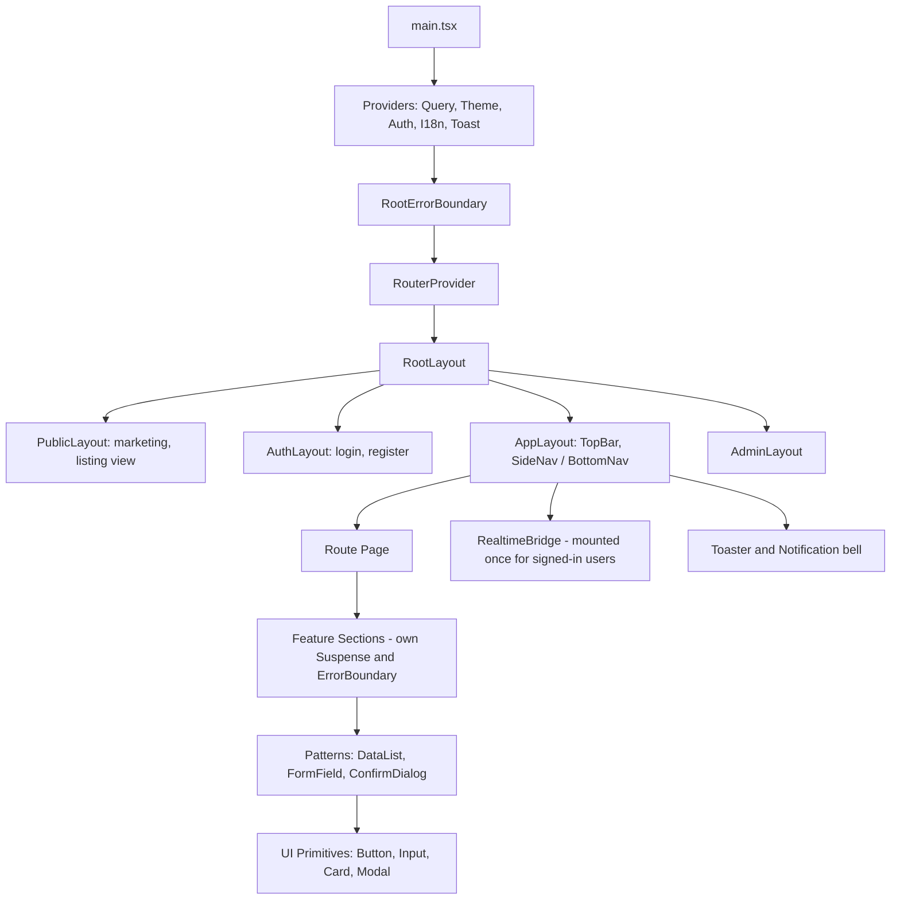
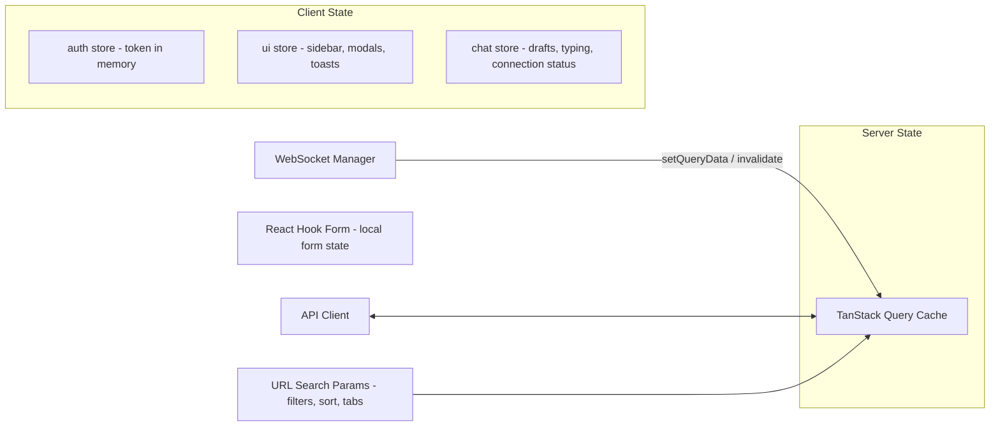
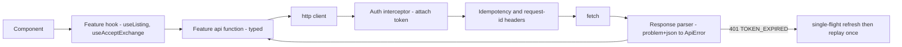
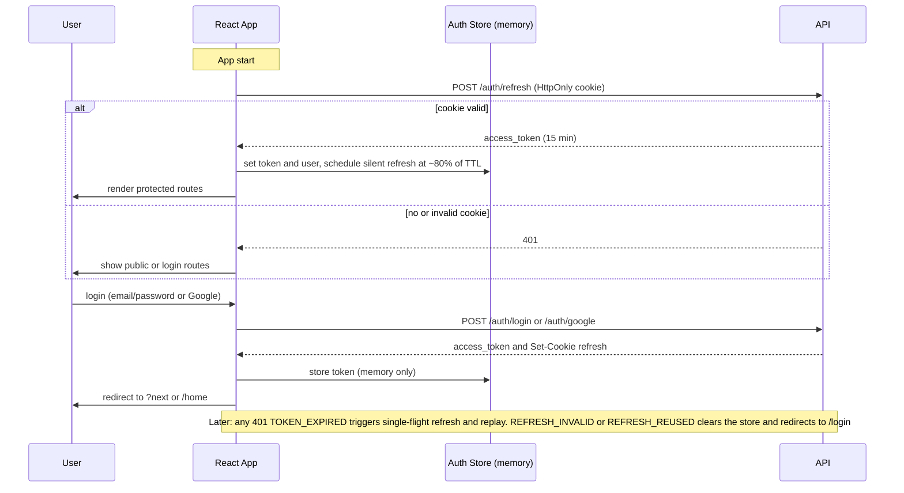
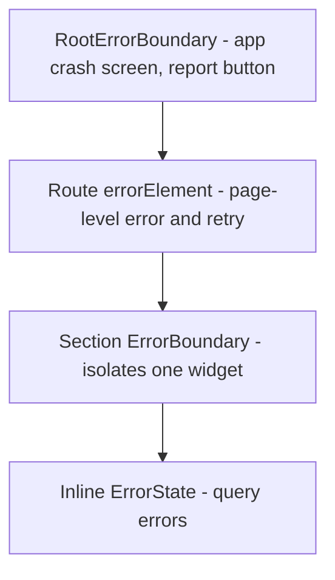

# BookBridge — Frontend Architecture

**Author:** Senior Frontend Engineer · **Inputs:** PRD, HLD, REST API spec · **Stack:** React 18, TypeScript (strict), Tailwind CSS.

---

## 1. Architectural Decisions at a Glance

| Decision | Choice | Why | Rejected alternative |
| --- | --- | --- | --- |
| App model | **Vite + React SPA**, hosted on S3 + CloudFront (per HLD) | Fast DX and builds, cheap global CDN hosting, no Node servers to operate. The product is mostly authenticated and interactive (exchange, chat) | Next.js SSR: more infra and complexity for a mostly-authenticated app |
| SEO / sharing | Public pages (listing, book, journey, club) get **edge-injected meta/Open Graph tags** (CloudFront Function or Lambda@Edge fetching a tiny `/meta` API), with a clear migration path to Next.js/Remix if organic search becomes the main growth channel | Link previews on WhatsApp are critical for a sharing product; full SSR is not yet | Pure SPA with no meta: ugly share cards |
| Code organisation | **Feature-sliced** (`features/exchange`, `features/chat`) | Mirrors backend modules, so a feature is owned end to end; deletes and refactors stay local | Layer-first (`components/`, `hooks/`): everything couples to everything |
| Server state | **TanStack Query** | Caching, dedupe, retries, pagination, optimistic updates, and invalidation are solved problems. Removes most global state | Redux for API data: boilerplate and manual cache logic |
| Client state | **Zustand** (small stores) + React Context only for static DI (theme, i18n) | Minimal API, no provider pyramid, selectors avoid re-render storms | Redux Toolkit: heavier than needed; Context for frequently changing state: re-render problems |
| URL as state | Search filters, sort, tab and pagination live in **URL query params** | Shareable, back-button-correct, refresh-safe | Filters in Zustand: lost on refresh and not shareable |
| Forms | **React Hook Form + Zod** | Uncontrolled inputs = fast; Zod schemas give TS types and runtime validation mirroring the API rules | Formik: more re-renders |
| API contract | **Types generated from OpenAPI** (`openapi-typescript`) + thin typed fetch client | Frontend breaks at compile time when the backend contract changes | Hand-written types drift |
| Styling | **Tailwind + design tokens (CSS variables) + `cva` variants + Radix primitives** | Utility speed, consistent theming, accessible headless behaviour (dialogs, menus, tabs) | CSS-in-JS: runtime cost; full component libs (MUI): hard to give BookBridge its own identity |
| Routing | **React Router v6.4+ data router**, lazy routes | Route-level code splitting, loaders for prefetch, per-route error elements | Hand-rolled routing |
| Realtime | One **WebSocket manager** that writes into the Query cache; REST remains source of truth | Single connection, simple reconnect/catch-up (matches API design) | Per-component sockets |
| Testing | Vitest + React Testing Library + MSW + Playwright + Storybook | Test behaviour, mock at the network layer, run critical journeys in a real browser | Snapshot-heavy testing |

## 2. Folder Structure

```text
bookbridge-web/
├── index.html
├── vite.config.ts · tailwind.config.ts · tsconfig.json · eslint/ prettier
├── .env.[mode]                      # public runtime config only (API base URL, feature flags)
├── public/                          # favicons, manifest, robots
├── openapi/                         # openapi.json snapshot (input to type generation)
├── .storybook/ · e2e/               # component docs, Playwright journeys
└── src/
    ├── main.tsx                     # bootstrap: providers, Sentry, mount
    │
    ├── app/                         # APPLICATION SHELL (wiring only)
    │   ├── providers/               # QueryProvider, ThemeProvider, AuthProvider, I18nProvider, ToastProvider
    │   ├── router/                  # routes.tsx, guards (RequireAuth, RequireRole), lazy route map
    │   ├── layouts/                 # RootLayout, AppLayout (nav), AuthLayout, AdminLayout, ChatLayout
    │   └── error/                   # RootErrorBoundary, RouteErrorPage, NotFoundPage
    │
    ├── features/                    # BUSINESS FEATURES (vertical slices)
    │   ├── auth/                    # api/, hooks/, components/, store.ts, schemas.ts, pages/
    │   ├── profile/
    │   ├── listings/                # create wizard, edit, detail, my-listings
    │   ├── search/                  # filters, results, map toggle
    │   ├── exchange/                # request button, timeline, pickup, handover, extension, dispute
    │   ├── chat/                    # conversation list, thread, composer, realtime bindings
    │   ├── notifications/
    │   ├── reviews/ · trust/
    │   ├── wishlist/
    │   ├── clubs/
    │   ├── journey/
    │   ├── dashboard/
    │   └── admin/
    │      (each feature: api/ · hooks/ · components/ · pages/ · schemas.ts · types.ts · index.ts)
    │
    ├── shared/                      # CROSS-FEATURE, NO BUSINESS LOGIC
    │   ├── ui/                      # design system: Button, Input, Select, Modal, Sheet, Tabs, Toast, Skeleton, Avatar, Badge, Card, EmptyState, Pagination...
    │   ├── patterns/                # composed: DataList, InfiniteList, FormField, ConfirmDialog, ImageUploader, RatingStars, LocationPicker
    │   ├── api/                     # http client, interceptors, error types, generated types, query-key factory
    │   ├── realtime/                # WebSocket manager, event router
    │   ├── hooks/                   # useDebounce, useMediaQuery, useInfiniteScroll, useGeolocation, useIdempotencyKey...
    │   ├── lib/                     # formatters (date, distance, currency), cn(), storage wrapper, analytics
    │   ├── config/                  # env parsing (zod), feature flags, constants
    │   ├── i18n/                    # en.json, hi.json
    │   └── styles/                  # tokens.css, globals.css
    │
    └── test/                        # MSW handlers, render helpers, factories
```

**Boundary rules (enforced by ESLint `import/no-restricted-paths`):**

1. `shared` imports nothing from `features` or `app`.
2. `features` may import `shared`; a feature may import another feature **only through its `index.ts` public API**.
3. `app` composes features, and no feature imports `app`. *Why:* the same dependency direction as the backend; it prevents circular imports and keeps features independently lazy-loadable and deletable.

## 3. Component Hierarchy



**Component tiers and why:**

| Tier | Knows about | Example | Rule |
| --- | --- | --- | --- |
| **UI primitives** (`shared/ui`) | Nothing but props + tokens | `Button`, `Modal` | Pure, accessible, themed, documented in Storybook |
| **Patterns** (`shared/patterns`) | Generic data shapes | `InfiniteList<T>`, `FormField` | Compose primitives; still domain-free |
| **Feature components** | Domain types + hooks | `ListingCard`, `ExchangeTimeline` | Presentational where possible: props in, events out |
| **Containers / sections** | Data fetching | `SearchResultsSection` | Call hooks, handle loading/error, pass data down |
| **Pages** | Routes | `ListingDetailPage` | Thin: layout + sections + params |

*Why separate containers from presentational components:* presentational pieces are trivially testable and reusable (ListingCard in search, wishlist, profile, club); data concerns stay in one place.

## 4. Routing

Lazy-loaded per route (`React.lazy` + route `lazy()`), so first load downloads only what is needed.

| Path | Layout | Guard | Page | Loader / prefetch |
| --- | --- | --- | --- | --- |
| `/` | Public | none (redirect to `/home` if signed in) | Landing | none |
| `/login`, `/register`, `/forgot-password`, `/reset-password`, `/verify-email` | Auth | `RedirectIfAuthed` | Auth pages | none |
| `/home` | App | Auth | Feed: nearby books, wishlist matches, active exchanges | prefetch feed queries |
| `/search` | App/Public | none | Search results (filters in URL) | prefetch from URL params |
| `/listings/new` | App | Auth + verified | Create-listing wizard | reference data |
| `/listings/:id` | Public | none | Listing detail | listing query + OG meta |
| `/listings/:id/edit` | App | Auth + owner | Edit listing | listing |
| `/books/:id` | Public | none | Book page (reviews, copies) | book |
| `/copies/:id/journey` | Public | none | Book Journey timeline | journey |
| `/exchanges` | App | Auth | My exchanges (tabs: incoming, outgoing, history) | list |
| `/exchanges/:id` | App | Auth + participant | Exchange detail + timeline + chat panel | exchange |
| `/chat`, `/chat/:conversationId` | Chat | Auth | Inbox; thread | conversations |
| `/wishlist` | App | Auth | Wishlist | list |
| `/clubs`, `/clubs/:id/*` | App | Auth | Club discovery; club tabs (about, schedule, discussions, polls, events, members) | club |
| `/notifications` | App | Auth | Full list + preferences tab | list |
| `/dashboard` | App | Auth | Personal analytics | stats |
| `/u/:id` | Public/App | none | Public profile | profile |
| `/settings/*` | App | Auth | Profile, security, notifications, privacy, data export/delete | profile |
| `/admin/*` | Admin | `RequireRole(moderator)` | Users, listings, reports, disputes, audit, stats | per page |
| `*` | Root | none | NotFound | none |

**Decisions**

- **Nested routes + layouts** keep nav persistent while pages swap, and let errors be contained to the outlet.
- **Guards are route-level wrappers** reading auth state; a failed guard redirects to `/login?next=<path>`, and after login the user returns where they were.
- **Role guards are UX only.** The API enforces security; the guard just avoids showing screens that would 403.
- **Public routes** (`/listings/:id`, `/books/:id`, `/copies/:id/journey`) work signed-out and show a "Sign in to request" CTA, which supports sharing and growth.

## 5. State Management



| State type | Tool | Examples | Why |
| --- | --- | --- | --- |
| Server data | TanStack Query | listings, exchanges, notifications | Single source of truth for remote data; no copying into stores |
| Auth/session | Zustand (in memory) | access token, user, roles | Must be readable outside React (API interceptor) |
| Ephemeral UI | Zustand / component `useState` | modals, sidebar, toasts, chat drafts | Local first; global only if truly shared |
| Navigation state | URL | filters, sort, tab, cursor | Shareable and restorable |
| Form state | React Hook Form | wizard steps, edit profile | Isolated re-renders, validation lifecycle |
| Persisted prefs | `localStorage` via a typed wrapper | theme, last city, dismissed banners | **Never tokens**; wrapper try/catches and versions keys |

**Query design**

- **Query key factory** per feature (`listingKeys.detail(id)`, `exchangeKeys.list(filters)`) so invalidation is precise and typo-proof.
- **Stale times by volatility:** reference data 1 h; listing detail 60 s; search 30 s; exchange and chat 0 plus WebSocket updates; notifications count 10 s.
- **Mutations** invalidate or directly update affected keys. High-confidence actions use **optimistic updates** (mark notification read, wishlist add/remove, poll vote, RSVP) with rollback on error. **Exchange transitions are NOT optimistic**: the server is the authority, and the UI shows a pending state, then renders the returned `allowed_actions`.
- **Infinite queries** for cursor-paginated lists, with `getNextPageParam` from `page.next_cursor`.
- **Retry policy:** retry network/5xx up to 2 times with backoff; never retry 4xx.

## 6. API Layer



| Concern | Design | Why |
| --- | --- | --- |
| Client | Thin `fetch` wrapper (no heavy library) with generics tied to generated OpenAPI types | Small bundle, full type safety |
| Auth | Adds `Authorization`; on `401 TOKEN_EXPIRED` performs **one shared refresh promise** (single-flight) so N parallel failures trigger one refresh, then replays requests once | Prevents refresh stampedes and token rotation races |
| Errors | Parses `application/problem+json` into a typed `ApiError {status, code, detail, fieldErrors, requestId}` | UI branches on stable `code`, never on message text |
| Idempotency | Mutation helper generates an `Idempotency-Key` per user intent (kept across retries of the same click, new on a new intent) | Double-tap and flaky network safety |
| Concurrency | Stores `ETag` from GETs and sends `If-Match` on PATCH; on 412 shows "this changed, reload" | Prevents silent overwrites |
| Cancellation | `AbortController` wired to Query's signal | Typing in search cancels stale requests |
| Pagination | `fetchPage(cursor)` helpers returning `{data, page}` | Matches API |
| Uploads | `POST /uploads/signatures`, then direct browser upload with progress, then pass `asset_id` | API never proxies large files |
| Observability | Every request carries/captures `X-Request-ID`; failures attach it to Sentry and the "Report problem" dialog | Support can trace user issues |
| Mocking | MSW handlers generated from the same OpenAPI spec | Dev and tests work without a backend |

## 7. Authentication Flow



| Decision | Reason |
| --- | --- |
| **Access token in memory only** | Not readable by XSS from storage; lost on reload, which is acceptable because the refresh cookie restores it |
| **Refresh token in HttpOnly SameSite cookie** (set by the API) | JavaScript can never read it; CSRF risk is limited by SameSite=Strict and by the refresh endpoint requiring no cookie-authenticated state changes beyond issuing tokens |
| **Boot-time silent refresh with a splash screen** (`AuthGate`) | Avoids a flash of "logged-out" UI and wrong redirects |
| **Proactive refresh timer + reactive 401 handling** | Smooth sessions and safety if the clock or timer is off |
| **Multi-tab sync via `BroadcastChannel`** | Logout in one tab logs out all; login propagates; avoids parallel refreshes fighting over rotation |
| **Google sign-in via Google Identity Services** | Sends the ID token to `/auth/google`; no OAuth redirect handling in SPA state |
| **Email-verification gating** | `verified` flag drives "Verify your email" banners and disables listing/requests with a clear CTA (`EMAIL_NOT_VERIFIED`) |
| **Account states** | `ACCOUNT_SUSPENDED` renders a dedicated full-page notice with appeal info |
| **WebSocket auth** | Fetch a short-lived ticket (`POST /realtime/tickets`) before each connect, so the long-lived token is never in a URL |
| **Cache hygiene on logout** | `queryClient.clear()`, close sockets, reset stores, so no data leaks to the next user on a shared device |

## 8. Reusable Components

| Tier | Components | Notes |
| --- | --- | --- |
| **Primitives** | Button (variants: primary, secondary, ghost, danger; sizes; loading), IconButton, Input, Textarea, Select, Combobox, Checkbox, Radio, Switch, Slider, Tabs, Modal, Sheet/Drawer, Popover, Tooltip, Dropdown, Toast, Badge, Avatar, Card, Skeleton, Spinner, Progress, Divider, Breadcrumb | Radix-based, keyboard + ARIA complete, `cva` variants, token-driven |
| **Patterns** | `FormField` (label, hint, error), `DataList`/`InfiniteList` (loading, empty, error, load-more), `FilterBar` (URL-synced), `ConfirmDialog`, `ImageUploader` (drag/drop, progress, reorder), `RatingStars`, `LocationPicker`, `EmptyState`, `ErrorState`, `StepWizard`, `Timeline`, `StatusBadge`, `RelativeTime`, `CopyLinkButton` | Domain-free, take render props |
| **Domain** | `ListingCard`, `BookCover`, `ConditionBadge`, `ExchangeTypeChip`, `TrustBadge`, `UserChip`, `ExchangeTimeline`, `ActionBar` (renders buttons from `allowed_actions`), `PickupPlanner`, `MessageBubble`, `Composer`, `ReviewCard`, `PollWidget`, `EventCard`, `JourneyTimeline`, `StatCard`, `NotificationItem` | Presentational; data via props |

**Design rule:** components accept `className` for layout tweaks only (merged with `cn()`), and style changes happen through variants, which keeps the design system consistent.

## 9. Custom Hooks

| Hook | Purpose |
| --- | --- |
| `useAuth()` / `useRequireAuth()` / `useHasRole()` | Session access and guard helpers |
| `useListing(id)`, `useCreateListing()`, `useMyListings(filters)` | Listing queries/mutations |
| `useSearch()` | Reads filters from URL, debounces `q`, builds query, exposes `setFilter` that updates URL |
| `useInfinitePage(queryFn)` | Wraps infinite queries and intersection-observer load-more |
| `useExchange(id)`, `useExchangeAction(action)` | Fetch + transition mutation with error-code to message mapping and idempotency key |
| `useConversation(id)`, `useSendMessage()` | Message list (with optimistic pending bubble using `client_msg_id`) and send |
| `useRealtime()` | Subscribe to events; auto-reconnect with backoff; `after=` catch-up on reconnect |
| `useNotifications()`, `useUnreadCount()` | Inbox + badge (updated by realtime events) |
| `useWishlistToggle(bookId)` | Optimistic add/remove |
| `useImageUpload()` | Signed upload flow, progress, cancel, compress client-side before upload |
| `useGeolocation()` | Permission-aware location; falls back to profile city; never blocks UI |
| `useDebounce`, `useMediaQuery`, `useLocalStorage`, `useOnClickOutside`, `useCountdown` | Utilities |
| `useFormWithApiErrors(schema)` | RHF + Zod; maps `fieldErrors` from problem+json onto fields |
| `useBeforeUnloadGuard(dirty)` | Prevents losing unsaved wizard data |

**Why hooks per feature:** components never call `fetch`; they call intent-named hooks, so changing an endpoint or cache strategy changes one file.

## 10. Theme and Design Tokens

**Identity:** warm, literary, trustworthy ("a friendly library, not a marketplace"). Avoids the cold SaaS look and the hard-sell e-commerce look.

| Token group | Definition |
| --- | --- |
| **Colour** (CSS variables, HSL, `:root` and `.dark`) | `--brand` deep teal (trust), `--accent` warm amber (books/paper), `--surface`, `--surface-raised`, `--border`, `--text`, `--text-muted`; semantic: `--success`, `--warning`, `--danger`, `--info`. Status colours map to book states: Available (green), Reserved (amber), Borrowed (blue), Exchanged/Donated (purple) |
| **Typography** | Headings: a serif (e.g. Source Serif/Lora) for literary character; body/UI: Inter. Scale 12/14/16/18/20/24/30/36; line-height 1.5 body. Self-hosted fonts with `font-display: swap` |
| **Spacing/radius/shadow** | 4-px base scale; radius 8/12/16 (soft); 3 elevation levels |
| **Motion** | 150–200 ms ease-out; all animation off under `prefers-reduced-motion` |
| **Dark mode** | Class strategy, defaults to system preference, user override persisted; all components use tokens so there are no per-component dark hacks |
| **Accessibility** | WCAG 2.1 AA contrast verified on tokens; visible focus ring token; minimum 44 px touch targets |
| **Tailwind config** | Colours/radii/fonts reference the CSS variables, so theme changes (seasonal, per-college white-label later) are token swaps with no component edits |

## 11. Error Boundaries and Error UX



| Level | Catches | UX |
| --- | --- | --- |
| **Root** | Catastrophic render errors, chunk-load failures | Full-page "Something went wrong" with Reload and request/Sentry ID; chunk-load error triggers an automatic one-time reload for the new deploy |
| **Route (`errorElement`)** | Loader errors, page render errors, 404/403 from loaders | Page-level message keeping the nav intact; "Try again", "Go home" |
| **Section** | One failing widget (e.g. recommendations, notifications bell) | Only that card shows an inline error with retry, and the rest of the page works |
| **Query/mutation errors** | Typed `ApiError` | Mapped by `code` to user-friendly copy. Field errors go to form fields, toasts for transient failures, inline banners for blocking states |

**Error-code mapping examples:** `COPY_NOT_AVAILABLE` → "Someone else just reserved this book" with refreshed listing; `RATE_LIMITED` → countdown from `Retry-After`; `PRECONDITION_FAILED` → "This was updated elsewhere. Reload"; `DEPENDENCY_UNAVAILABLE` → degraded banner; offline → persistent "You're offline" bar and queued read-only mode. All unexpected errors are reported to Sentry with user id (hashed), route, and request ID; expected 4xx are not reported as errors.

## 12. Loading States

| Situation | Pattern | Why |
| --- | --- | --- |
| First page load | App shell + `AuthGate` splash, then route chunk via `Suspense` fallback of **page-shaped skeletons** | Perceived speed; avoids layout shift |
| Lists | Card skeletons matching real layout, infinite scroll with trailing skeleton row | No jumpy content |
| Background refetch | Keep stale data visible + subtle top progress bar (`isFetching`) | No flicker |
| Mutations | Button-level loading + disabled state; optimistic for safe actions; exchange transitions show an inline pending state | Prevents double submits, honest feedback |
| Images | Reserved aspect ratio, blur-up/LQIP from Cloudinary, `loading="lazy"`, responsive `srcset` | Prevents CLS; saves data on mobile |
| Navigation | **Prefetch on hover/focus/intent** for listing cards and nav links; route loaders warm the cache | Near-instant transitions |
| Empty / zero data | `EmptyState` with a primary action ("List your first book") | Turns dead ends into engagement |
| Slow network | After 400 ms a skeleton shows (avoids flash for fast responses); after 10 s a "taking longer than usual" hint with retry | Calibrated feedback |

## 13. Page Structure

| Page | Structure (top to bottom) |
| --- | --- |
| **Home** | Greeting + location chip → "Active exchanges" strip (action-needed first) → Wishlist matches → Nearby books carousel → Trending in your college → Clubs → CTA to list a book |
| **Search** | Search bar + filter chips → (desktop) left filter panel, results grid, optional map; (mobile) filter bottom sheet → active-filter pills → results list with infinite scroll → facets |
| **Listing detail** | Image gallery → title/author/condition/type → owner card with trust → availability and CTA (Request / Sign in) → description → book reviews → other copies → similar books → Journey teaser |
| **Create listing wizard** | Step 1 ISBN scan/lookup or manual → Step 2 details → Step 3 photos → Step 4 condition + exchange type + pickup area → Review and publish |
| **Exchange detail** | Header (book, counterpart, status) → **Timeline** → `ActionBar` (only legal actions) → Pickup planner → Due date/extension → Chat panel → Review prompt when completed |
| **Chat** | Conversation list (left) + thread (right); mobile: list → thread as separate screens |
| **Dashboard** | Stat cards → reading streak → genre chart → impact (money saved, CO₂) → history |
| **Club** | Cover + join → tabs: About, Schedule, Discussions, Polls, Events, Members |
| **Profile** | Avatar, bio, trust breakdown, listings, reviews, reading history |
| **Admin** | Sidebar (Users, Listings, Reports, Disputes, Spam, Audit, Stats) → dense data tables with filters, side-panel detail, action dialogs requiring a reason |

## 14. Wireframes

### 14.1 Search (Desktop, ≥1024 px)

```text
┌──────────────────────────────────────────────────────────────────────────────┐
│ ☰ BookBridge   [ 🔍 Search title, author, ISBN…          ]  📍Guwahati  🔔3 👤 │
├───────────────┬──────────────────────────────────────────────────────────────┤
│ FILTERS       │  128 books near you          Sort: [Relevance ▾]  [▦][🗺]    │
│ Exchange type │  Active: (Fiction ✕)(≤10 km ✕)(Good+ ✕)                       │
│ ☑ Borrow      │ ┌────────┐ ┌────────┐ ┌────────┐ ┌────────┐                  │
│ ☐ Exchange    │ │ [cover]│ │ [cover]│ │ [cover]│ │ [cover]│                  │
│ ☐ Donate      │ │ Title  │ │ Title  │ │ Title  │ │ Title  │                  │
│ Distance      │ │ Author │ │ Author │ │ Author │ │ Author │                  │
│ ──●──── 10 km │ │ ●Avail │ │ ●Avail │ │ ◐Resv. │ │ ●Avail │                  │
│ Condition     │ │ 📍2.1km│ │ 📍3km  │ │ 📍4km  │ │ 📍6km  │                  │
│ [Good+ ▾]     │ │ ★4.8 A.│ │ ★4.5 R.│ │ ★5.0 S.│ │ ★4.2 M.│                  │
│ Language      │ └────────┘ └────────┘ └────────┘ └────────┘                  │
│ Genre  College│  … skeleton row while loading more …                         │
│ [Clear all]   │                                                              │
└───────────────┴──────────────────────────────────────────────────────────────┘
```

### 14.2 Search (Mobile, 360 px)

```text
┌──────────────────────┐
│ BookBridge     🔔  👤 │
│ [🔍 Search books…  ] │
│ (Filters•3)(Sort ▾)  │
│ ┌──────────────────┐ │
│ │[cover] Title      │ │
│ │        Author     │ │
│ │ ●Available 📍2 km │ │
│ │ Borrow · Good  ★4.8│ │
│ └──────────────────┘ │
│ ┌──────────────────┐ │
│ │[cover] Title …    │ │
│ └──────────────────┘ │
├──────────────────────┤
│ 🏠   🔍   ➕   💬   👤 │  ← bottom nav
└──────────────────────┘
```

Filters open in a full-height bottom sheet with an "Apply (128 results)" button.

### 14.3 Listing Detail

```text
┌───────────────────────────────────────────────────────────────┐
│ ← Back                                              ♡  ⤴ Share│
│ ┌───────────────────┐  Title of the Book                      │
│ │   Main image      │  by Author Name · English · 2nd ed.     │
│ │                   │  ●Available   Condition: Good           │
│ └───────────────────┘  Borrow up to 21 days                   │
│  ▫ ▫ ▫ ▫ thumbnails    ┌───────────────────────────────────┐  │
│                        │ 👤 Aarav · IIT Guwahati · 📍2.1 km │  │
│                        │ Trust 92 ▮▮▮▮▮▮▮▮▮▯  18 exchanges │  │
│                        └───────────────────────────────────┘  │
│                        [   Request this book   ]  (primary)   │
│ Description …                                                 │
│ ── Book Journey ── 3 readers · "Changed how I think…" →       │
│ ── Reviews ★4.6 (12) ──  ── Other copies nearby ──            │
└───────────────────────────────────────────────────────────────┘
```

Signed-out: the CTA becomes "Sign in to request". Mobile: gallery swipes, CTA is a sticky bottom bar.

### 14.4 Exchange Detail

```text
┌───────────────────────────────────────────────────────────────┐
│ [cover] Title · with Meera (Owner)           Status: ACCEPTED │
├───────────────────────────────────────────────────────────────┤
│ ●──────●──────○──────○──────○                                 │
│ Requested Accepted Pickup  Borrowed Returned                  │
│            ▲ you are here                                     │
├──────────────────────────────┬────────────────────────────────┤
│ Next step                    │ 💬 Chat                        │
│ Agree a pickup time & place  │ Meera: Can we meet at the      │
│ ┌──────────────────────────┐ │ library gate at 5?             │
│ │ Library gate · Sat 5 PM  │ │ You: Works for me 👍           │
│ │ [Accept] [Counter-propose]│ │ [ type a message…   ] [📎][➤] │
│ └──────────────────────────┘ │                                │
│ Due date: —   [Cancel request]│                               │
└──────────────────────────────┴────────────────────────────────┘
```

Mobile: tabs "Details | Chat" with an unread dot on Chat. The action buttons are derived solely from `allowed_actions`.

### 14.5 Create Listing Wizard (Mobile)

```text
┌──────────────────────┐
│ ✕  List a book  1/4  │
│ ▮▮▯▯                 │
│ [📷 Scan barcode   ] │
│ or enter ISBN        │
│ [978-………………   ] [Find]│
│ ✓ Found: "Title"     │
│   Author · Publisher │
│ Language [English ▾] │
│ Genre   [Fiction ▾]  │
│            [ Next → ]│
└──────────────────────┘
```

Progress is autosaved as a local draft (guarded against accidental exit).

### 14.6 Dashboard (Desktop)

```text
┌─────────────┬─────────────┬─────────────┬─────────────┐
│ 📚 Read 24  │ 🔄 Borrowed │ 🤝 Lent 11  │ 🔥 Streak   │
│             │    17       │             │   9 days    │
├─────────────┴─────────────┼─────────────┴─────────────┤
│ Favourite genres (donut)  │ Impact                    │
│                           │ ₹4,200 saved · 6.3 kg CO₂ │
├───────────────────────────┴───────────────────────────┤
│ Reading history (timeline list)                       │
└───────────────────────────────────────────────────────┘
```

## 15. Responsive Design

**Mobile-first**, because the primary audience (students in India) is mostly on mid-range Android phones with variable connectivity.

| Breakpoint | Width | Layout |
| --- | --- | --- |
| base | \< 640 px | Single column, **bottom tab nav** (Home, Search, List, Chat, Profile), sheets instead of modals, sticky CTA bars |
| `sm` | ≥ 640 | 2-column card grid |
| `md` | ≥ 768 | Top nav replaces bottom nav; 3-column grid; modals replace sheets |
| `lg` | ≥ 1024 | Persistent filter sidebar; 2-pane chat; 4-column grid |
| `xl` | ≥ 1280 | Max content width 1280 px, optional right rail (notifications/active exchanges) |

**Techniques and rationale**

- **Responsive primitives:** `Modal` renders as a bottom `Sheet` on small screens using one component (`useMediaQuery`), not two code paths in every feature.
- **Fluid sizing:** `clamp()` typography, container queries for cards that live in different-width slots (grid vs carousel).
- **Touch-first:** 44 px targets, swipe gallery, pull-to-refresh on lists, no hover-only affordances.
- **Performance budget (mid-range phone on 4G):** initial JS ≤ 180 KB gz, LCP ≤ 2.5 s, INP ≤ 200 ms, CLS ≤ 0.1; enforced in CI with Lighthouse CI and bundle-size checks.
- **Optimisation:** route splitting, vendor chunk splitting, icon tree-shaking, Cloudinary `f_auto,q_auto,w_*` responsive images, list virtualisation for long chat/notification lists, prefetch only on Wi-Fi/high-bandwidth (`navigator.connection`).
- **Offline/PWA (later):** installable manifest and service worker caching shell + recent listings; read-only offline; background sync for queued messages.
- **Accessibility:** semantic landmarks, focus management on route change and in dialogs, live regions for toasts and new messages, full keyboard operation, tested with axe in CI.

## 16. Cross-Cutting Concerns

| Concern | Approach |
| --- | --- |
| **Security** | No tokens in storage; strict CSP (no inline scripts); sanitise any rich text with DOMPurify before render (bios, posts, messages); `rel="noopener"` on external links; no secrets in the bundle |
| **i18n** | `react-i18next`, ICU plurals, English first then Hindi; no hard-coded strings; dates/numbers via `Intl` |
| **Analytics** | Thin `track()` wrapper (consent-aware) emitting product events aligned to the PRD funnel (search → request → accept → complete) |
| **Feature flags** | Runtime flags to dark-launch clubs/chat features |
| **Observability** | Sentry (errors + performance), web-vitals reporting, request IDs |
| **Env/config** | Build once, deploy many: runtime `config.json` fetched at boot (API URL, flags) rather than baked per environment |
| **CI/CD** | Typecheck, lint, unit, Storybook build, a11y check, Playwright smoke on preview deploy, bundle budgets; deploy to S3 with hashed assets + short-TTL `index.html`; CloudFront invalidation |
| **Testing pyramid** | Many component/hook tests with MSW; contract check that the generated API types are current; Playwright for the 5 golden journeys (signup, list, search, request-accept-handover-return, chat) |

## 17. Key Trade-offs

| Choice | Benefit | Cost accepted |
| --- | --- | --- |
| SPA over SSR | Simple ops, cheap hosting, rich interactivity | Weaker SEO; mitigated by edge meta tags and a Next.js migration path |
| Feature-sliced folders | Ownership, local reasoning, lazy loading | Some duplication; boundary rules needed |
| TanStack Query as the data layer | Less code, fewer bugs | Team must learn cache semantics and key design |
| Non-optimistic exchange transitions | Correctness over speed | Slightly slower perceived response, offset by clear pending UI |
| Access token in memory | XSS-resistant | Needs boot-time refresh and multi-tab coordination |
| Generated API types | Compile-time contract safety | Build step and dependency on a stable OpenAPI spec |
| Radix + Tailwind (own design system) | Unique identity, full control, accessibility | Higher initial effort than adopting a ready kit |