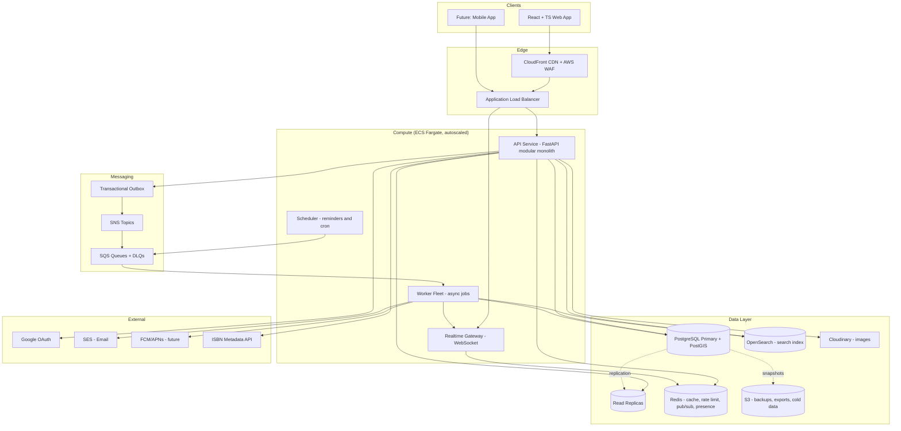
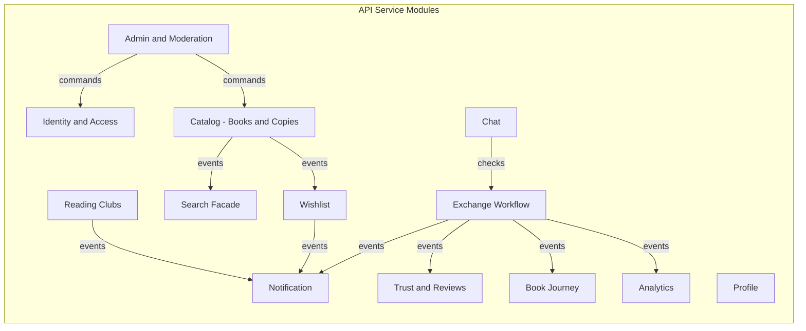
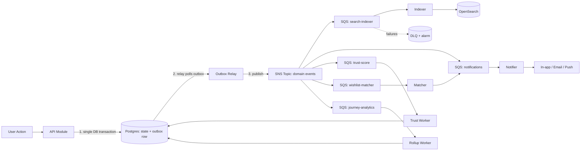
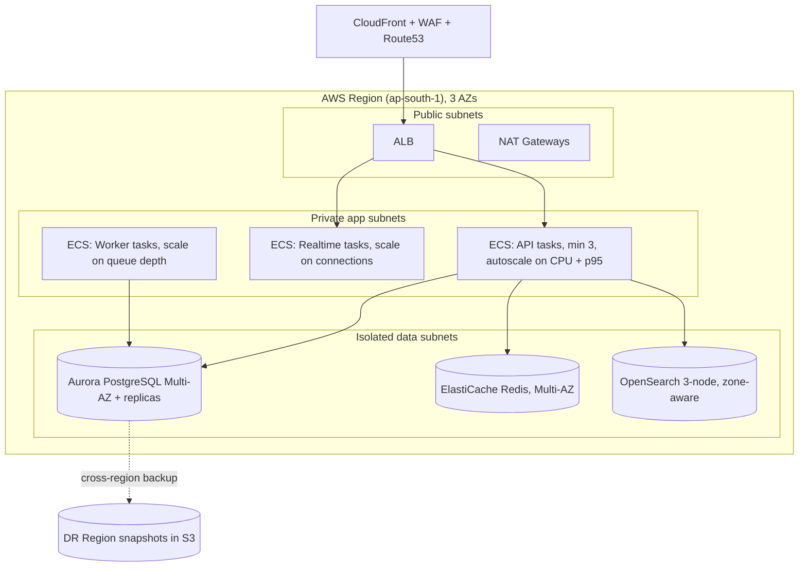
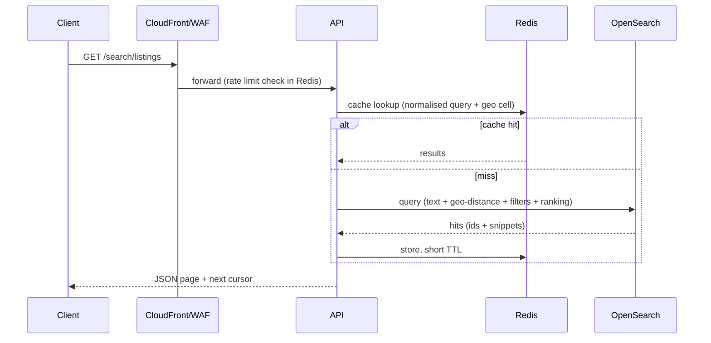
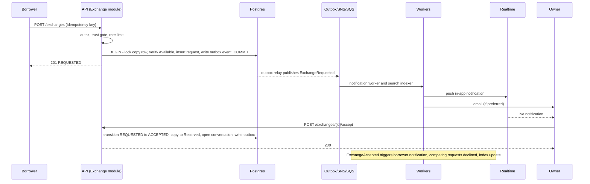
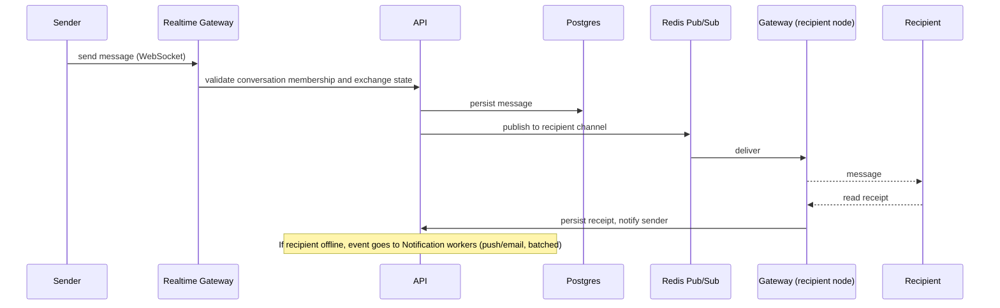

# BookBridge — High Level Architecture (HLD)

**Author:** Staff SDE · **Input:** BookBridge PRD v1.0 · **Scale target:** 1M+ users, 100k+ DAU, 1M+ listings, designed to grow 10x without redesign.

---

## 1. System Overview

BookBridge is a **read-heavy, geo-aware, workflow-driven** platform. Three traffic shapes drive the design:

| Shape | Examples | Design implication |
| --- | --- | --- |
| Read-heavy discovery (\~90% of traffic) | Search, listing pages, profiles | Dedicated search index, CDN, Redis cache |
| Transactional workflow (low volume, high correctness) | Exchange state machine, trust score | PostgreSQL ACID, optimistic locking, idempotency |
| Async and real-time fan-out | Notifications, chat, reminders, wishlist matching | Event bus, queues, workers, WebSocket gateway |

### Core architectural decision: **Modular monolith first, event-driven boundaries, extract by evidence**

- **Why not microservices on day one?** A small team would pay distributed-systems tax (network failures, distributed transactions, per-service CI/CD, tracing) before having scale problems. Amazon's own guidance is to split along proven load or ownership boundaries.
- **Why not a plain monolith?** Search, chat and notifications have very different scaling and failure profiles from the exchange workflow.
- **Chosen approach:** one FastAPI codebase organised into strictly isolated bounded-context modules (no cross-module DB access; communication via public interfaces and domain events). **Three runtime units are separated from day one:** the API, the Worker fleet, and the Realtime (WebSocket) gateway. The same image is deployed with different entry points. Any module can later become its own service because its only coupling is events and an interface.

## 2. Major Components

**Decisions explained**

| Decision | Reason | Alternative rejected |
| --- | --- | --- |
| CloudFront + WAF at the edge | Absorbs static and image traffic, blocks bots/DDoS before they hit compute | Direct ALB exposure: cost and attack surface |
| ECS Fargate | No cluster ops for a small team, per-task autoscaling, easy migration to EKS later since workloads are containers | EKS: powerful but heavy operational overhead at MVP |
| PostgreSQL as system of record | Relational integrity for exchanges, ACID state transitions, PostGIS for geo | DynamoDB: weak ad-hoc queries and joins for this domain |
| OpenSearch for search | Fuzzy match, relevance tuning, geo-distance and facets at p95 \< 300 ms; offloads Postgres | Postgres FTS: fine at MVP, degrades with ranking + geo + facets at millions of rows |
| Redis | Sub-ms cache, token-bucket rate limiting, WebSocket fan-out pub/sub, presence | Memcached: no pub/sub or data structures |
| Outbox + SNS/SQS | Guarantees events are published if and only if the DB transaction commits | Dual writes: lost or phantom events |
| Cloudinary behind a storage interface | On-the-fly transforms, CDN built in; interface allows swap to S3 + CloudFront + Lambda image resize at scale | Hard-coding vendor: lock-in |

## 3. Module Breakdown and Responsibilities

| Module | Responsibilities | Owns (data) | Why separate |
| --- | --- | --- | --- |
| **Identity and Access** | Registration, login, Google OAuth, JWT issue/rotate/revoke, password reset, RBAC | users, credentials, sessions, roles | Security boundary; strictest review and lowest change rate |
| **Profile** | Bio, city, college, interests, picture | profiles | Changes often, separate from credentials |
| **Catalog** | Book (abstract work) vs **Copy** (physical item) vs listing; status lifecycle; images | books, copies, listings | The Copy-vs-Book split is what enables Book Journey and ISBN dedup |
| **Search Facade** | Query building, ranking, filters, index sync | OpenSearch index (derived) | Isolates search engine; index is rebuildable from Postgres |
| **Exchange** | State machine, reservation, pickup details, confirmations, disputes | exchange_requests, transitions, audit | Core correctness domain; highest invariants |
| **Chat** | Conversations gated by an existing exchange, messages, receipts | conversations, messages | Different scaling curve (write-heavy, append-only) |
| **Notification** | Template, preference, channel routing (in-app, email, push), dedupe, batching | notifications, preferences | Pure consumer of events; can fail without blocking core flows |
| **Trust and Reviews** | Reviews, trust score computation, abuse weighting | reviews, trust_scores | Computation is async, eventually consistent |
| **Wishlist** | Wishlist items, matching on new availability | wishlists | Event-driven matcher |
| **Reading Clubs** | Clubs, schedules, polls, threads, events | clubs, memberships, posts | Independent product surface, low coupling |
| **Book Journey** | Append-only timeline per copy | journey_entries | Immutable history, built from exchange events |
| **Analytics** | Per-user dashboard aggregates, impact calculations | rollups | Read model; never queries live transactional tables |
| **Admin and Moderation** | Reports queue, bans, takedowns, spam signals, audit log | reports, moderation_actions | Elevated privilege; separate RBAC scope and audit |

**Rules enforced in the codebase:** a module never reads another module's tables; cross-module reads use a public interface; cross-module side effects use domain events; CI runs an import-boundary check. This is what makes later extraction cheap.

## 4. Data Flow

**Decisions explained**

- **Transactional outbox:** state change and event are written in one DB transaction, so a crash cannot lose or invent events. A relay publishes afterwards with at-least-once delivery.
- **SNS fan-out to per-consumer SQS queues:** each consumer scales, retries and fails independently. A slow email provider cannot delay search indexing.
- **At-least-once + idempotent consumers:** every event has an ID; consumers dedupe. This is simpler and more robust than attempting exactly-once.
- **DLQs with alarms:** poison messages are isolated and replayable.
- **CQRS-lite:** writes go to Postgres; reads for search go to OpenSearch, dashboards to rollup tables. Index and rollups are derived and rebuildable, so they can lag by seconds without risking correctness. Exchange state is always read from Postgres.
- **Consistency model:** strong consistency for exchange state, listings and auth; eventual consistency for search, trust score, notifications, analytics.

## 5. Service Communication

| Path | Style | Why |
| --- | --- | --- |
| Client → API | REST/JSON over HTTPS, versioned `/v1`, OpenAPI | Required by PRD; cacheable, tooling-friendly |
| Client ↔ Realtime | WebSocket (SSE fallback) | Bidirectional chat and live notifications |
| Module → module (in-process) | Public interface calls (synchronous, same transaction when needed) | No network cost, easy atomic operations |
| Module → module (side effects) | Domain events via outbox → SNS/SQS | Decoupling, resilience, extractability |
| Worker → Realtime | Redis pub/sub | Push events to the exact gateway node holding the user's socket |
| API → external (Google, ISBN, SES) | HTTPS with timeouts, retries with jitter, circuit breaker, cached results | Third-party failure must not cascade |
| Future internal services | gRPC for sync calls; events remain the default | Strong contracts, low latency |

**Cross-cutting policies**

- Every request gets a **correlation ID** propagated through logs, events and traces.
- **Idempotency keys** on mutating endpoints (request book, confirm handover, send message).
- **Timeouts everywhere**, bulkheads per dependency, bounded retries, no unbounded queues.
- **Sagas, not distributed transactions:** multi-step flows (accept → reserve → decline competitors → notify) use local transactions plus compensating events.

## 6. Technology Stack

| Layer | Choice | Rationale |
| --- | --- | --- |
| Frontend | React + TypeScript + Tailwind, TanStack Query, hosted on S3 + CloudFront | Required stack; typed contracts via generated OpenAPI client; query cache cuts API load |
| API | FastAPI (async), Uvicorn/Gunicorn, Pydantic | High throughput async I/O, auto OpenAPI, strong validation |
| ORM and migrations | SQLAlchemy 2 (async) + Alembic | Required; versioned, reviewable schema changes |
| Primary DB | PostgreSQL (RDS/Aurora) + PostGIS | ACID, geo queries, partitioning, read replicas |
| Search | Amazon OpenSearch | Fuzzy, relevance, geo; vector (k-NN) ready for semantic search later |
| Cache and coordination | Redis (ElastiCache) | Cache, rate limit, pub/sub, presence |
| Messaging | SNS + SQS (Kafka/MSK later for streaming/graph matching) | Managed, durable, cheap; Kafka only once replay and stream processing are required |
| Background jobs | Dedicated worker containers (Celery-compatible or SQS-native consumers) + EventBridge Scheduler | Elastic by queue depth; scheduler survives restarts |
| Image storage | Cloudinary behind an adapter (S3 + CloudFront fallback) | Required; abstraction prevents lock-in |
| Email / Push | SES / FCM + APNs | Cost-effective, deliverability tooling |
| Auth | Own JWT (short-lived access + rotating refresh in HttpOnly cookie), argon2, Google OIDC | Required; Redis denylist for revocation |
| Observability | OpenTelemetry → CloudWatch/Grafana/Prometheus, Sentry, structured JSON logs | Vendor-neutral instrumentation |
| Config and secrets | SSM Parameter Store, Secrets Manager, feature flags (e.g. Unleash/AppConfig) | Centralised config as required |
| IaC and CI/CD | Terraform, GitHub Actions, container scanning, Alembic migration gates | Reproducible, auditable |

**Chat storage decision:** start with partitioned Postgres tables keyed by conversation (acceptable to low millions of messages/day). The chat module's repository interface lets us migrate to DynamoDB or Cassandra when message volume demands it, without touching other modules.

## 7. Deployment Overview

**Decisions and practices**

- **Multi-AZ everywhere, stateless compute:** losing an AZ degrades capacity but not availability (99.9% SLO).
- **Network isolation:** data stores sit in isolated subnets, reachable only from app security groups.
- **Environments:** dev → staging (production-like, load tests) → prod; separate AWS accounts.
- **Release strategy:** rolling or blue/green via ECS with health checks and automatic rollback; **expand-and-contract migrations** so old and new code run against the same schema.
- **Scaling signals:** API on CPU and latency, workers on SQS queue depth, realtime on open connections. Postgres scales via read replicas first, then partitioning (messages, notifications, events), then functional sharding of high-volume modules if needed.
- **Disaster recovery:** PITR backups, RPO ≤ 15 min, RTO ≤ 1 h, quarterly restore drills.
- **Cost control:** CDN-heavy image delivery, cache-first reads, spot capacity for workers.

## 8. High Level APIs

All under `/v1`, JWT bearer auth, cursor pagination (`cursor`, `limit`), consistent error envelope, idempotency key header on mutations, rate-limited per user/IP.

| Domain | Representative endpoints |
| --- | --- |
| **Auth** | `POST /auth/register`, `/auth/login`, `/auth/refresh`, `/auth/logout`, `/auth/google`, `/auth/password/forgot`, `/auth/password/reset`, `/auth/verify-email` |
| **Users** | `GET/PATCH /users/me`, `GET /users/{id}`, `GET /users/{id}/trust`, `GET /users/{id}/reviews` |
| **Books and copies** | `POST /listings`, `GET/PATCH/DELETE /listings/{id}`, `POST /listings/{id}/images` (signed upload), `PATCH /listings/{id}/availability`, `GET /isbn/{isbn}` |
| **Search** | `GET /search/listings?q=&city=&college=&lat=&lng=&radius=&condition=&type=&available=` |
| **Exchange** | `POST /exchanges`, `GET /exchanges/{id}`, `POST /exchanges/{id}/accept`, `/reject`, `/cancel`, `/pickup`, `/confirm-handover`, `/confirm-return`, `/extend`, `/dispute` |
| **Chat** | `GET /conversations`, `GET/POST /conversations/{id}/messages`, `POST /conversations/{id}/read`; `WS /realtime` |
| **Notifications** | `GET /notifications`, `POST /notifications/read`, `GET/PUT /notifications/preferences` |
| **Reviews** | `POST /exchanges/{id}/reviews`, `GET /listings/{id}/reviews` |
| **Wishlist** | `GET/POST /wishlist`, `DELETE /wishlist/{id}` |
| **Clubs** | `POST/GET /clubs`, `POST /clubs/{id}/join`, `/schedule`, `/polls`, `/polls/{id}/vote`, `/threads`, `/events` |
| **Journey** | `GET /copies/{id}/journey`, `POST /copies/{id}/journey/notes` |
| **Dashboard** | `GET /me/dashboard` |
| **Admin** | `GET /admin/reports`, `POST /admin/users/{id}/suspend`, `DELETE /admin/listings/{id}`, `GET /admin/audit` |

**API design decisions:** exchange actions are modelled as **explicit state-transition endpoints** rather than a generic PATCH, so each transition has its own authorisation, validation and event. Cursor pagination avoids deep-offset cost on large tables. Image upload uses **signed direct-to-storage URLs**, keeping large binaries off API servers.

## 9. Request Flows

### 9.1 Search (read path, latency-critical)

Why: queries are bucketed by **geo cell** so popular areas share cache entries; TTL is short because availability changes. Search hits return denormalised fields, so no per-result DB calls. Final availability is re-verified in Postgres when a user opens a listing or requests it, so stale index entries cannot cause incorrect exchanges.

### 9.2 Borrow request (write path, correctness-critical)

Why: **row-level locking plus optimistic version checks** prevent two borrowers reserving the same copy. The HTTP response returns after the DB commit only, and everything else is asynchronous, which keeps the user-facing latency low and the core flow independent of email, search or push availability. Chat is created at accept time, enforcing the "chat only after an exchange exists" rule structurally.

### 9.3 Chat message

### 9.4 Authentication

Login verifies credentials (or Google ID token), issues a 15-minute JWT access token and a rotating refresh token (stored hashed, HttpOnly cookie). Refresh-token reuse triggers family revocation. Access tokens are validated statelessly at the API, with a small Redis denylist for logout, bans and role changes. Admin routes require role claims plus a fresh-session check.

## 10. Cross-Cutting Concerns

| Concern | Approach |
| --- | --- |
| **Rate limiting** | Redis token bucket at WAF (coarse), API gateway layer (per-IP) and per-user per-action (strict on auth, requests, messaging) |
| **Caching** | Cache-aside; listing/profile TTL caching with event-driven invalidation; CDN for images and static assets |
| **Security** | WAF, TLS, RBAC claims, input validation, signed URLs, secrets manager, least-privilege IAM, audit log for admin and state changes, approximate-only location exposure, DPDP deletion and export jobs |
| **Resilience** | Circuit breakers, retries with jitter, DLQs, graceful degradation (search down → fallback to Postgres basic query; notifications down → queued) |
| **Observability** | Golden signals per module, business SLIs (request→accept time, reminder delivery), SLO-based alerts, trace sampling |
| **Data governance** | Soft deletes, retention policies, PII encryption at rest, backups, per-module data ownership |

## 11. Evolution Path (when to split)

| Trigger | Action |
| --- | --- |
| Search QPS or relevance work outgrows API | Extract Search service owning the index and ranking |
| Chat write volume or connection count | Extract Chat service, move storage to DynamoDB/Cassandra |
| Notification volume or provider complexity | Extract Notification service (already event-only) |
| Need replay, streaming, graph matching (A→B→C) | Introduce Kafka/MSK and a Matching service over a graph store |
| Read load on Postgres | Replicas → caching tiers → partition/shard hot tables |
| Multiple teams | Split by bounded context; keep event contracts versioned in a schema registry |
| Semantic search | Add embedding pipeline workers and OpenSearch k-NN or a vector store |

## 12. Key Trade-offs Summary

1. **Modular monolith over microservices:** speed and simplicity now, with extraction paths preserved.
2. **Postgres for truth, derived stores for speed:** correctness never depends on the search index or cache.
3. **Events over synchronous coupling:** resilience and extensibility, at the cost of eventual consistency (accepted for non-critical views).
4. **SQS/SNS over Kafka initially:** lower operational burden; Kafka deferred until replay and stream processing justify it.
5. **Managed services over self-hosting:** a small team spends effort on product logic, not infrastructure.