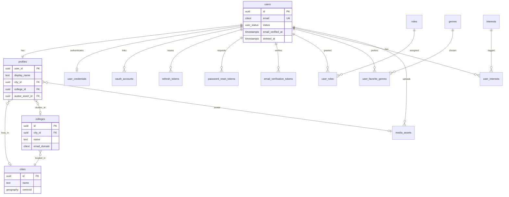
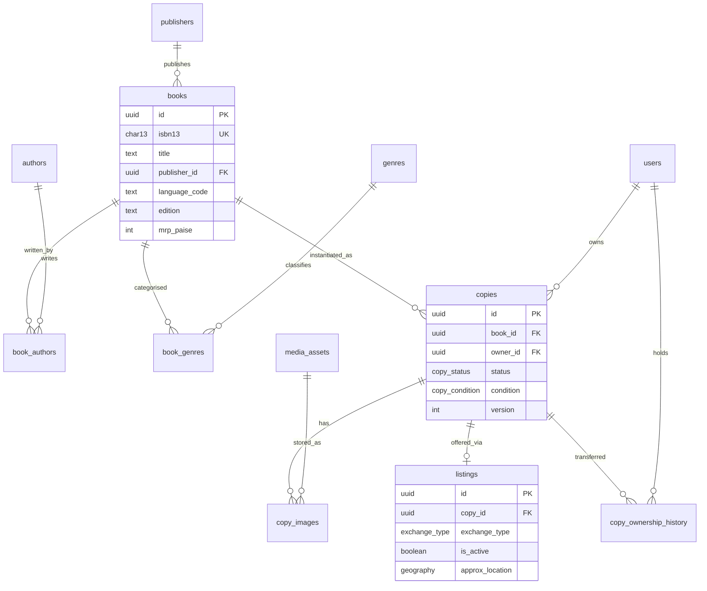
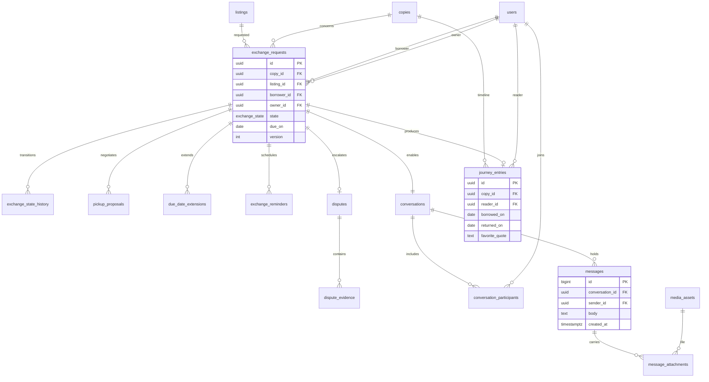
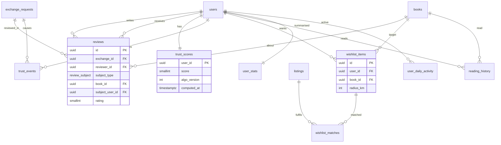
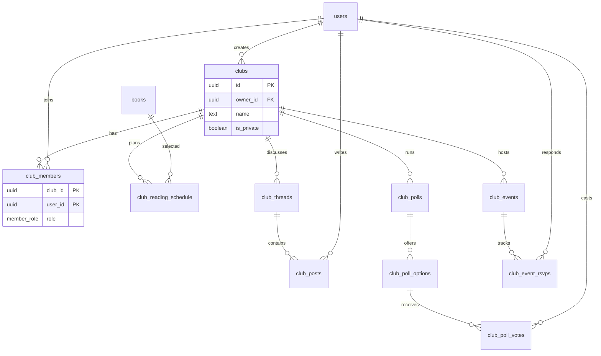
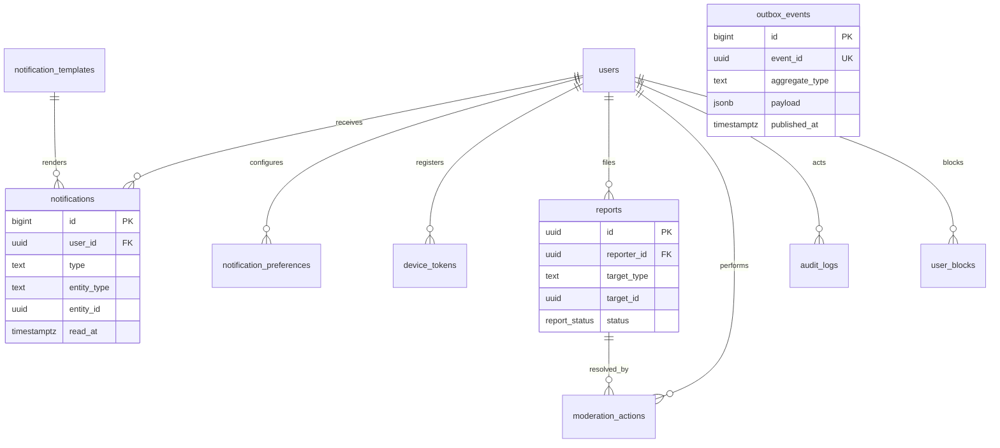

# BookBridge — PostgreSQL Schema Design

## 1. Design Principles and Conventions

| Decision | Choice | Why |
| --- | --- | --- |
| Primary keys | `uuid` (v7, time-ordered) on all business tables; `bigint identity` on pure join/ledger/high-volume append tables | v7 gives non-guessable public IDs (no enumeration attacks) with near-sequential B-tree inserts (no random-UUID index bloat). Bigint is smaller/faster for internal ledgers |
| Time | `timestamptz` UTC everywhere; `created_at`, `updated_at` on mutable tables | No timezone bugs, auditable |
| Deletes | Soft delete (`deleted_at`) on users, copies, listings, posts; hard delete only on join rows and via DPDP erasure job | Preserves exchange history and journey integrity |
| Enums | Postgres `ENUM` for closed stable sets (status, role); lookup tables for open sets (genre, college, city) | Enums are compact and enforced; lookup tables allow admin edits without migrations |
| Concurrency | `version int` on `copies` and `exchange_requests` for optimistic locking, plus `SELECT … FOR UPDATE` on the copy row during reservation | Prevents double reservation |
| Location | `geography(Point,4326)` with GiST indexes; stored **fuzzed** (≈300 m grid) for listings | Distance filters in SQL while protecting user privacy |
| Ownership | Each module owns its tables; **no cross-module FKs for soft references** (e.g. notifications→entity uses `entity_type + entity_id`). Hard FKs inside a module and to `users`/`copies` core tables | Keeps modules extractable into services |
| Naming | `snake_case`, plural tables, `<table>_id` FKs | Consistency |

**Enum types:** `user_status(active, suspended, banned, deleted)`, `role_name(user, club_admin, moderator, admin, organisation)`, `copy_status(available, reserved, borrowed, exchanged, donated)`, `copy_condition(new, like_new, good, fair, poor)`, `exchange_type(lend, exchange, donate)`, `exchange_state(requested, accepted, pickup_scheduled, borrowed, return_pending, returned, completed, rejected, cancelled, expired, disputed)`, `review_subject(book, exchange, user)`, `member_role(owner, moderator, member)`, `report_status(open, in_review, resolved, dismissed)`, `reading_status(want, reading, finished, abandoned)`, `channel(in_app, email, push)`.

---

## 2. ER Diagrams

### 2.1 Identity, Profile and Reference Data

### 2.2 Catalog and Copies

### 2.3 Exchange, Chat, Journey

### 2.4 Trust, Reviews, Wishlist, Reading, Analytics

### 2.5 Clubs

### 2.6 Notifications, Moderation, Platform

---

## 3. Table Catalogue

Legend: **PK** primary key, **FK→** foreign key, **UK** unique, **CK** check, **IX** index. `ON DELETE` default is `RESTRICT` unless stated.

### 3.1 Identity and Access

| Table | Columns | Constraints and indexes | Purpose |
| --- | --- | --- | --- |
| **users** | `id` PK, `email` citext, `status`, `email_verified_at`, `last_login_at`, `created_at`, `updated_at`, `deleted_at` | UK(lower email) partial where `deleted_at is null`; IX(status) | Account identity only, no profile data (keeps the hot auth row small) |
| **user_credentials** | `user_id` PK/FK→users CASCADE, `password_hash`, `password_updated_at`, `failed_attempts`, `locked_until` | One row per user | Separated so password hashes are never loaded by general queries and can have stricter DB grants. Absent for Google-only users |
| **oauth_accounts** | `id` PK, `user_id` FK→users CASCADE, `provider`, `provider_user_id` | UK(provider, provider_user_id); IX(user_id) | Multiple login methods per user |
| **refresh_tokens** | `id` PK, `user_id` FK, `family_id`, `token_hash`, `expires_at`, `revoked_at`, `replaced_by` FK→self, `user_agent`, `ip` | UK(token_hash); IX(user_id), IX(family_id), IX(expires_at) | Rotating refresh tokens with reuse detection (family revocation) |
| **password_reset_tokens** | `id` PK, `user_id` FK CASCADE, `token_hash`, `expires_at`, `used_at` | UK(token_hash); IX(user_id) | Single-use expiring reset links |
| **email_verification_tokens** | same shape as above | UK(token_hash) | Email verification |
| **roles** | `id` smallint PK, `name` role_name UK, `description` | Seeded | Role catalogue for RBAC |
| **user_roles** | `user_id` FK CASCADE, `role_id` FK, `granted_by` FK→users, `granted_at` | PK(user_id, role_id) | Many-to-many RBAC |

### 3.2 Profile and Reference Data

| Table | Columns | Constraints and indexes | Purpose |
| --- | --- | --- | --- |
| **cities** | `id` PK, `name`, `state`, `country_code`, `centroid` geography | UK(name, state); GiST(centroid) | Canonical locations; avoids free-text city variants |
| **colleges** | `id` PK, `city_id` FK, `name`, `email_domain`, `is_verified` | UK(city_id, name); IX(email_domain) | Campus clusters for search and the verification badge |
| **media_assets** | `id` PK, `owner_id` FK→users SET NULL, `provider` (cloudinary/s3), `public_id`, `url`, `mime_type`, `bytes`, `width`, `height`, `status` (pending/ready/rejected), `created_at` | UK(provider, public_id); IX(owner_id) | Single table for all uploaded files, so every image reference is an FK instead of duplicated URLs |
| **profiles** | `user_id` PK/FK→users CASCADE, `display_name`, `bio`, `avatar_asset_id` FK→media_assets, `city_id` FK, `college_id` FK, `home_location` geography (fuzzed), `search_radius_km` default 10, `locale` | CK(char_length(bio) ≤ 500); IX(city_id), IX(college_id), GiST(home_location) | 1:1 with users, mutable public profile data |
| **genres** | `id` smallint PK, `slug` UK, `name`, `parent_id` FK→self |  | Hierarchical genre taxonomy |
| **interests** | `id` PK, `slug` UK, `name` |  | Reading interests (themes, topics), distinct from genres |
| **user_favorite_genres** | `user_id` FK CASCADE, `genre_id` FK | PK(user_id, genre_id) | M:N |
| **user_interests** | `user_id` FK CASCADE, `interest_id` FK | PK(user_id, interest_id) | M:N |
| **user_blocks** | `blocker_id` FK, `blocked_id` FK, `created_at` | PK(blocker_id, blocked_id); CK(blocker_id \<> blocked_id) | Block list enforced in chat, requests and search |

### 3.3 Catalog

| Table | Columns | Constraints and indexes | Purpose |
| --- | --- | --- | --- |
| **publishers** | `id` PK, `name` UK |  | Normalised publisher |
| **authors** | `id` PK, `name`, `normalized_name` | IX(normalized_name) trigram | Normalised author |
| **books** | `id` PK, `isbn13` char(13) nullable, `isbn10`, `title`, `subtitle`, `publisher_id` FK, `language_code`, `edition`, `published_year`, `description`, `cover_asset_id` FK, `page_count`, `mrp_paise`, `source` (isbn_api/user), `created_at` | UK(isbn13) where not null; CK(isbn13 \~ '^\[0-9\]{13}$'); GIN trigram(title); IX(language_code) | The *abstract edition* shared by all copies. Deduplicates metadata, so reviews, wishlists and recommendations attach to the book, not to each owner's duplicate |
| **book_authors** | `book_id` FK CASCADE, `author_id` FK, `position` | PK(book_id, author_id); IX(author_id) | M:N, ordered authors |
| **book_genres** | `book_id` FK CASCADE, `genre_id` FK | PK(book_id, genre_id); IX(genre_id) | M:N |
| **copies** | `id` PK, `book_id` FK, `owner_id` FK→users, `original_owner_id` FK→users, `status` copy_status, `condition`, `condition_notes`, `owner_notes`, `version`, `created_at`, `updated_at`, `deleted_at` | IX(owner_id, status); IX(book_id, status) partial where status='available'; CK(version ≥ 0) | **A physical book.** Persistent identity across owners, which is the foundation of Book Journey. `owner_id` is the current holder |
| **copy_images** | `id` PK, `copy_id` FK CASCADE, `asset_id` FK, `position` smallint, `is_primary` | UK(copy_id, position); UK(copy_id) where is_primary; CK(position between 0 and 5) | Up to 6 ordered photos |
| **listings** | `id` PK, `copy_id` FK, `exchange_type`, `is_active`, `approx_location` geography, `city_id` FK, `college_id` FK, `max_loan_days`, `pickup_notes`, `created_at`, `updated_at`, `deleted_at` | **UK(copy_id) where is_active** (one active listing per copy); GiST(approx_location) partial where active; IX(city_id, exchange_type) where active; IX(college_id) where active | The *offer*. Separate from the copy so offers can be paused or changed while the physical item's identity remains. Denormalises city/college for index-only filtering (documented, maintained by trigger) |
| **copy_ownership_history** | `id` bigint PK, `copy_id` FK, `from_user_id` FK, `to_user_id` FK, `exchange_id` FK nullable, `reason` (exchange/donation/initial), `transferred_at` | IX(copy_id, transferred_at) | Append-only record of permanent ownership changes (exchange/donate). Lending does not change ownership |

### 3.4 Exchange

| Table | Columns | Constraints and indexes | Purpose |
| --- | --- | --- | --- |
| **exchange_requests** | `id` PK, `copy_id` FK, `listing_id` FK, `borrower_id` FK, `owner_id` FK, `exchange_type`, `state`, `requested_days`, `message`, `due_on`, `handed_over_at`, `returned_at`, `owner_confirmed_handover`, `borrower_confirmed_handover`, `owner_confirmed_return`, `borrower_confirmed_return`, `expires_at`, `cancelled_by` FK, `cancel_reason`, `version`, `created_at`, `updated_at` | CK(borrower_id \<> owner_id); **UK(copy_id) where state in (accepted, pickup_scheduled, borrowed, return_pending, disputed)** (a copy has at most one live exchange); UK(copy_id, borrower_id) where state='requested' (no duplicate asks); IX(borrower_id, state, created_at desc); IX(owner_id, state, created_at desc); IX(due_on) where state='borrowed'; IX(expires_at) where state='requested' | Core workflow aggregate. The partial unique index is the database-level guarantee against double-reservation, even if application logic fails |
| **exchange_state_history** | `id` bigint PK, `exchange_id` FK CASCADE, `from_state`, `to_state`, `actor_id` FK, `reason`, `created_at` | IX(exchange_id, created_at) | Immutable audit trail of transitions. Computes response time and cancellation rate for trust |
| **pickup_proposals** | `id` PK, `exchange_id` FK CASCADE, `proposed_by` FK, `place_text`, `place_location` geography, `proposed_time`, `status` (proposed/accepted/rejected), `created_at` | IX(exchange_id); partial UK(exchange_id) where status='accepted' | Negotiated pickup details; history of proposals retained |
| **due_date_extensions** | `id` PK, `exchange_id` FK CASCADE, `requested_by` FK, `new_due_on`, `status`, `decided_at` | IX(exchange_id) | Extension workflow |
| **exchange_reminders** | `id` bigint PK, `exchange_id` FK CASCADE, `kind` (t_minus_3, t_minus_1, due, overdue), `scheduled_for`, `sent_at` | UK(exchange_id, kind, scheduled_for); IX(scheduled_for) where sent_at is null | Idempotent reminder scheduling, polled by the scheduler |
| **disputes** | `id` PK, `exchange_id` FK UK, `opened_by` FK, `reason` (not_returned, damaged, other), `status`, `resolution`, `resolved_by` FK, `opened_at`, `resolved_at` | IX(status) | One dispute per exchange |
| **dispute_evidence** | `id` PK, `dispute_id` FK CASCADE, `submitted_by` FK, `note`, `asset_id` FK nullable | IX(dispute_id) | Evidence text/photos |

### 3.5 Chat

| Table | Columns | Constraints and indexes | Purpose |
| --- | --- | --- | --- |
| **conversations** | `id` PK, `exchange_id` FK **UK**, `status` (open/closed), `last_message_at`, `closes_at`, `created_at` | UK(exchange_id) | Created when an exchange is accepted. The mandatory FK enforces "chat only after an exchange exists" at schema level |
| **conversation_participants** | `conversation_id` FK CASCADE, `user_id` FK, `last_read_message_id` bigint, `last_read_at`, `muted` | PK(conversation_id, user_id); IX(user_id, conversation_id) | Membership and read receipts. A per-conversation read cursor is one row update instead of one row per message per reader |
| **messages** | `id` bigint identity PK, `conversation_id` FK, `sender_id` FK, `body`, `kind` (text/image/system), `client_msg_id` uuid, `created_at`, `deleted_at` | UK(conversation_id, client_msg_id) (idempotent retries); IX(conversation_id, id desc); CK(body not null or kind='image') | Append-only; bigint ids give a monotonic ordering for cursors and receipts. **Partitioned** (see §6) |
| **message_attachments** | `id` PK, `message_id` bigint, `asset_id` FK | IX(message_id) | Image messages |

### 3.6 Reviews and Trust

| Table | Columns | Constraints and indexes | Purpose |
| --- | --- | --- | --- |
| **reviews** | `id` PK, `exchange_id` FK, `reviewer_id` FK, `subject_type` review_subject, `book_id` FK nullable, `subject_user_id` FK nullable, `rating` smallint, `title`, `body`, `is_hidden`, `created_at` | CK(rating between 1 and 5); CK(subject_type='book' → book_id not null; 'user' → subject_user_id not null; 'exchange' → both null); UK(exchange_id, reviewer_id, subject_type); IX(book_id) where subject_type='book'; IX(subject_user_id) where subject_type='user' | One table for three review kinds, because they share lifecycle (post-completion only), moderation and anti-abuse logic. The CHECK keeps it type-safe. Tying every review to a completed exchange blocks fake reviews structurally |
| **trust_scores** | `user_id` PK/FK CASCADE, `score` smallint, `successful_exchanges`, `on_time_return_rate`, `avg_rating`, `cancellation_rate`, `median_response_minutes`, `algo_version`, `computed_at` | CK(score between 0 and 100) | Current score and the component inputs, so the UI can show the breakdown. Written only by the trust worker |
| **trust_events** | `id` bigint PK, `user_id` FK, `exchange_id` FK nullable, `event_type` (completed, on_time_return, late_return, cancelled, reviewed, responded, reported), `value` numeric, `occurred_at` | IX(user_id, occurred_at desc) | Immutable ledger from which scores are recomputed, so the algorithm can be changed and replayed with no data loss |

### 3.7 Wishlist, Reading and Analytics

| Table | Columns | Constraints and indexes | Purpose |
| --- | --- | --- | --- |
| **wishlist_items** | `id` PK, `user_id` FK CASCADE, `book_id` FK, `radius_km`, `notify`, `fulfilled_at`, `created_at` | UK(user_id, book_id); IX(book_id) where notify and fulfilled_at is null | The matcher looks up by `book_id` when a new listing arrives, so the index is built for that direction |
| **wishlist_matches** | `id` PK, `wishlist_item_id` FK CASCADE, `listing_id` FK, `notified_at` | UK(wishlist_item_id, listing_id) | Deduplicates notifications |
| **reading_history** | `id` PK, `user_id` FK CASCADE, `book_id` FK, `copy_id` FK nullable, `status` reading_status, `started_on`, `finished_on`, `rating`, `source` (borrowed/owned/manual) | UK(user_id, book_id, started_on); IX(user_id, finished_on desc) | User-visible reading history, also fed automatically from completed exchanges |
| **user_daily_activity** | `user_id` FK, `activity_date` date, `pages_or_minutes`, `books_touched` | PK(user_id, activity_date) | Source for reading streak calculation |
| **user_stats** | `user_id` PK/FK, `books_read`, `books_borrowed`, `books_lent`, `books_donated`, `current_streak`, `longest_streak`, `money_saved_paise`, `co2_saved_grams`, `favorite_genre_id` FK, `updated_at` |  | Pre-aggregated dashboard row (denormalised by design, rebuildable from events) |

### 3.8 Book Journey

| Table | Columns | Constraints and indexes | Purpose |
| --- | --- | --- | --- |
| **journey_entries** | `id` PK, `copy_id` FK, `reader_id` FK, `exchange_id` FK UK, `borrowed_on`, `returned_on`, `review_id` FK nullable, `favorite_quote`, `lessons_learned`, `is_public`, `created_at` | CK(returned_on ≥ borrowed_on); UK(exchange_id); IX(copy_id, borrowed_on) | One timeline entry per hand-over of a physical copy. Quote and lessons are written by the reader after return |

### 3.9 Reading Clubs

| Table | Columns | Constraints and indexes | Purpose |
| --- | --- | --- | --- |
| **clubs** | `id` PK, `owner_id` FK, `name`, `slug` UK, `description`, `cover_asset_id` FK, `is_private`, `city_id` FK nullable, `college_id` FK nullable, `member_count`, `created_at`, `deleted_at` | IX(city_id), IX(college_id); trigram(name) | Club entity. `member_count` is a maintained counter |
| **club_members** | `club_id` FK CASCADE, `user_id` FK, `role` member_role, `status` (active/pending/removed), `joined_at` | PK(club_id, user_id); IX(user_id) | Membership and club-level RBAC |
| **club_reading_schedule** | `id` PK, `club_id` FK CASCADE, `book_id` FK, `starts_on`, `ends_on`, `target_notes` | CK(ends_on ≥ starts_on); IX(club_id, starts_on) | Reading schedules |
| **club_threads** | `id` PK, `club_id` FK CASCADE, `author_id` FK, `title`, `is_pinned`, `created_at` | IX(club_id, created_at desc) | Discussion topics |
| **club_posts** | `id` bigint PK, `thread_id` FK CASCADE, `author_id` FK, `parent_post_id` FK→self, `body`, `created_at`, `deleted_at` | IX(thread_id, id) | Replies, one level of nesting |
| **club_polls** | `id` PK, `club_id` FK CASCADE, `created_by` FK, `question`, `closes_at`, `multi_select` | IX(club_id, closes_at) | Polls |
| **club_poll_options** | `id` PK, `poll_id` FK CASCADE, `label`, `position` | UK(poll_id, position) | Options |
| **club_poll_votes** | `option_id` FK CASCADE, `user_id` FK, `poll_id` FK, `voted_at` | PK(option_id, user_id); partial UK(poll_id, user_id) enforced for single-select polls via trigger | One vote per user |
| **club_events** | `id` PK, `club_id` FK CASCADE, `created_by` FK, `title`, `description`, `starts_at`, `ends_at`, `location_text`, `location` geography, `capacity` | CK(ends_at > starts_at); IX(club_id, starts_at) | Events |
| **club_event_rsvps** | `event_id` FK CASCADE, `user_id` FK, `status` (going/maybe/no) | PK(event_id, user_id) | RSVPs |

### 3.10 Notifications

| Table | Columns | Constraints and indexes | Purpose |
| --- | --- | --- | --- |
| **notification_templates** | `key` text PK, `channel`, `subject_tpl`, `body_tpl`, `version` | PK(key, channel) | Versioned message templates |
| **notifications** | `id` bigint PK, `user_id` FK, `type`, `entity_type`, `entity_id`, `payload` jsonb, `dedupe_key`, `read_at`, `created_at` | UK(user_id, dedupe_key); IX(user_id, id desc); IX(user_id) where read_at is null | In-app inbox. Polymorphic soft reference on purpose (module decoupling). **Partitioned monthly** |
| **notification_preferences** | `user_id` FK CASCADE, `type`, `channel`, `enabled`, `quiet_start`, `quiet_end` | PK(user_id, type, channel) | Per-type, per-channel opt-in |
| **device_tokens** | `id` PK, `user_id` FK CASCADE, `platform`, `token` UK, `last_seen_at` | IX(user_id) | Future push |

### 3.11 Moderation and Platform

| Table | Columns | Constraints and indexes | Purpose |
| --- | --- | --- | --- |
| **reports** | `id` PK, `reporter_id` FK, `target_type` (user/listing/message/review/club/post), `target_id`, `reason`, `details`, `status`, `assigned_to` FK, `created_at`, `resolved_at` | IX(status, created_at); IX(target_type, target_id) | User reports; SLA is computed from timestamps |
| **moderation_actions** | `id` PK, `report_id` FK nullable, `moderator_id` FK, `action` (warn, hide, remove, suspend, ban, restore), `target_type`, `target_id`, `reason`, `expires_at`, `created_at` | IX(target_type, target_id) | Every enforcement decision |
| **audit_logs** | `id` bigint PK, `actor_id` FK nullable, `action`, `resource_type`, `resource_id`, `ip`, `metadata` jsonb, `created_at` | IX(actor_id, created_at); IX(resource_type, resource_id) | Append-only; **partitioned monthly**; revoke UPDATE/DELETE from the app role |
| **outbox_events** | `id` bigint PK, `event_id` uuid UK, `aggregate_type`, `aggregate_id`, `event_type`, `payload` jsonb, `created_at`, `published_at` | IX(id) where published_at is null | Transactional outbox (per HLD). Published rows are purged after a retention window |
| **processed_events** | `consumer` text, `event_id` uuid, `processed_at` | PK(consumer, event_id) | Consumer-side idempotency for at-least-once delivery |
| **idempotency_keys** | `key` text, `user_id` FK, `request_hash`, `response_status`, `response_body`, `created_at`, `expires_at` | PK(user_id, key); IX(expires_at) | Safe client retries for mutations |

**Total: 66 tables** across 11 modules.

---

## 4. Relationship Summary

| Relationship | Cardinality | Notes |
| --- | --- | --- |
| users ↔ profiles | 1:1 | Shared PK |
| users ↔ roles | M:N via user_roles |  |
| books ↔ copies | 1:N | One edition, many physical copies |
| copies ↔ listings | 1:N historically, 1:0..1 active | Partial unique index |
| listings ↔ exchange_requests | 1:N | Many borrowers may request; only one becomes live |
| exchange_requests ↔ conversations | 1:1 | Enforces chat gating |
| exchange_requests ↔ journey_entries | 1:0..1 | Created on completion |
| exchange_requests ↔ reviews | 1:N | Up to 6 per exchange (3 subject types × 2 reviewers) |
| books ↔ authors / genres | M:N |  |
| clubs ↔ users | M:N via club_members |  |
| wishlist_items ↔ listings | M:N via wishlist_matches |  |

## 5. Normalization

- **3NF baseline.** Publisher, author, genre, city, college and media are lookup/entity tables; no repeating groups; every non-key attribute depends on the key only. Book metadata lives in `books` once, never copied into `copies`.
- **BCNF decisions.** Join tables use composite PKs; `user_roles`, `book_authors`, `club_members` have no non-key attributes depending on a subset of the key.
- **Separation of volatility.** `users` (identity), `user_credentials` (secrets), `profiles` (public mutable data), `trust_scores` (computed) are split so hot, sensitive and derived data have different update rates and grants.

**Deliberate denormalisation (all documented, derivable, and trigger- or worker-maintained):**

| Denormalised field | Why | How it stays correct |
| --- | --- | --- |
| `listings.city_id`, `college_id`, `approx_location` | Index-only filtered search without joining profiles | Trigger on listing create/owner location change |
| `exchange_requests.owner_id` | Avoids joining copies for the owner inbox query | Immutable once set (copy owner at request time) |
| `clubs.member_count`, `conversations.last_message_at` | Avoid COUNT(\*)/MAX on hot paths | Updated in same transaction |
| `trust_scores` components, `user_stats` | Dashboard reads at O(1) | Rebuilt from `trust_events` / events; versioned |
| `copies.status` | Read frequently | Only changed by Exchange module in the same transaction as the state transition; CHECK via trigger against live exchange |

## 6. Indexing Strategy

1. **Partial indexes** for the hot subsets (available copies, active listings, live exchanges, unread notifications, unsent reminders, unpublished outbox) keep indexes small as history grows.
2. **GiST on geography** for radius queries (`ST_DWithin`) on listings, profiles, events.
3. **pg_trgm GIN** on book title, author name, club name for typo-tolerant fallback when search is degraded. Primary search is served from OpenSearch (HLD).
4. **Composite indexes follow the query**: (owner_id, state, created_at desc) matches "my incoming requests" exactly, so no sort step.
5. **Keyset pagination** uses (created_at, id) or bigint id indexes. No OFFSET.
6. **FK columns are indexed** wherever the parent is deleted/updated or joined from the child.
7. **Covering indexes (`INCLUDE`)** on listing search fallback (`copy_id, exchange_type, approx_location`).
8. **BRIN** on `audit_logs.created_at` and `outbox_events.created_at` for cheap range scans on append-only data.
9. **Review quarterly** with `pg_stat_statements` and `pg_stat_user_indexes` and drop unused indexes, because every index taxes writes.

## 7. Integrity and Security Constraints

- Cross-table invariants live in the DB where possible: partial unique indexes (one live exchange per copy, one active listing per copy), CHECKs (self-request, date order, rating range, review subject shape), and deferred FKs for transactional multi-row creation.
- **State machine guard:** a trigger on `exchange_requests` rejects illegal `from_state → to_state` pairs and inserts into `exchange_state_history`, as a second line of defence behind the application.
- **Roles:** `app_rw` (API), `worker_rw`, `readonly_analytics`, `migrator`. `audit_logs` is insert-only; `user_credentials` readable only by the Identity module's DB role.
- **Row-level security** is optional for admin/analytics roles; application-level authorisation is primary.
- **Privacy:** only fuzzed coordinates are stored for listings and profiles; exact pickup points live only in `pickup_proposals` and are visible to the two participants. PII erasure (DPDP) anonymises `users`/`profiles` and keeps exchange rows with the user replaced by a tombstone ID to preserve other users' history.

## 8. Future Scaling Considerations

| Concern | Strategy | Trigger |
| --- | --- | --- |
| **Connections** | PgBouncer (transaction pooling) in front of RDS/Aurora | From day one |
| **Read load** | Read replicas for search fallback, profile pages, dashboards; replica-lag-aware routing (read-your-writes after mutations) | > 60% primary CPU on reads |
| **messages** | Declarative partitioning: **range by month** on `created_at` (or hash on `conversation_id` into 64 partitions if per-conversation access dominates); detach and archive partitions older than 12 months to S3 (Parquet). Migrate to DynamoDB/Cassandra behind the repository interface at very high volume | > 500M rows |
| **notifications, audit_logs, exchange_state_history, trust_events, outbox_events** | Monthly range partitions; drop/archive old partitions (instant, no vacuum cost) | > 100M rows |
| **Hot tables (exchange_requests, copies, listings)** | Index and vacuum tuning (fillfactor 80–90 for HOT updates), partial indexes; later partition by `city_id` hash or functional shard by region | > 100M rows |
| **Search** | Postgres is the source; OpenSearch holds the read model, rebuildable via the outbox/CDC | Already in HLD |
| **Analytics** | CDC (Debezium/DMS) to a warehouse (Redshift/ClickHouse); dashboards read rollups, not OLTP | Before heavy BI needs |
| **Geo growth** | Region-based sharding keyed by `city_id` (Citus or app-level) as exchange is inherently local: a Mumbai exchange rarely touches a Delhi row | > 5–10 TB or write saturation |
| **Multi-region / DR** | Cross-region replica + PITR; RPO ≤ 15 min | Business requirement |
| **Embeddings (future)** | `book_embeddings(book_id PK, model, vector)` with pgvector, or OpenSearch k-NN | Semantic search phase |
| **Graph matching A→B→C (future)** | Materialise `exchange_offers/wants` edges from wishlist + listings into a graph store or a recursive-CTE job; results written to `exchange_chain_proposals` | Phase 6 |
| **Service extraction** | Each module's tables are already isolated (no cross-module hard FKs except to users/copies IDs), so a module moves to its own database by replicating those ID references | Team or load boundary |
| **Migrations** | Alembic with expand-and-contract; `CREATE INDEX CONCURRENTLY`; no long locks; backfills in batches | Always |
| **Maintenance** | Aggressive autovacuum on hot tables, bloat monitoring, `pg_repack`, regular restore drills | Always |

## 9. Future Tables (reserved, not in v1)

`book_embeddings`, `exchange_chain_proposals`, `donation_drives`, `drive_contributions`, `organisations`, `organisation_members`, `library_integrations`, `copy_qr_codes`, `condition_assessments`, `push_subscriptions`.