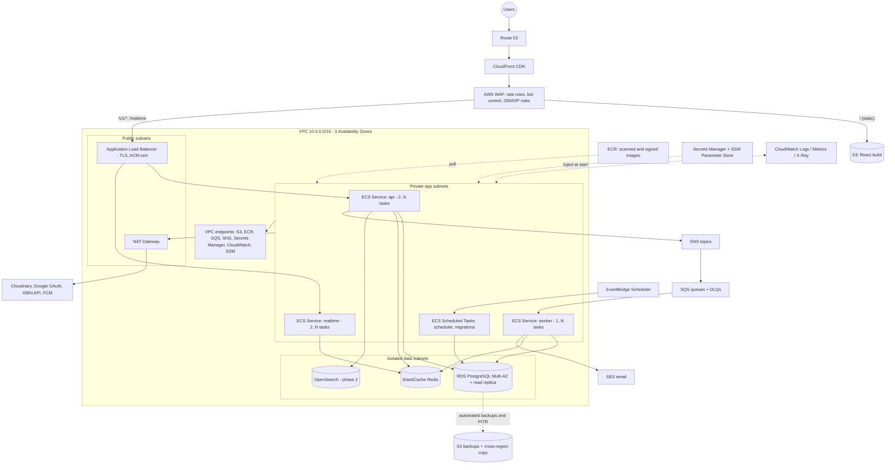
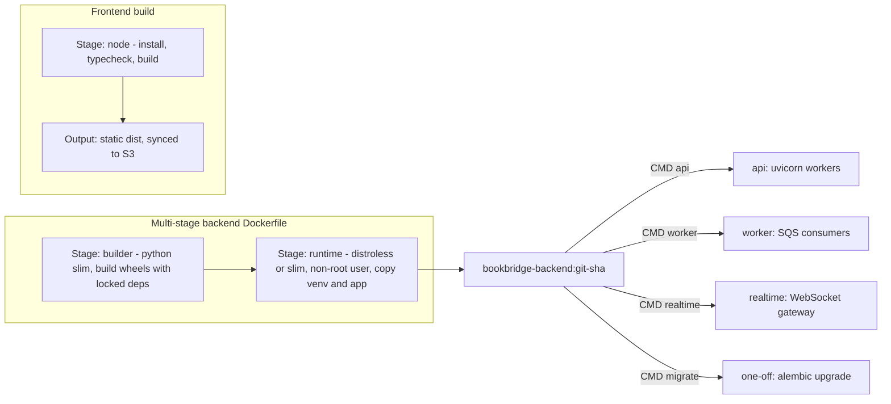
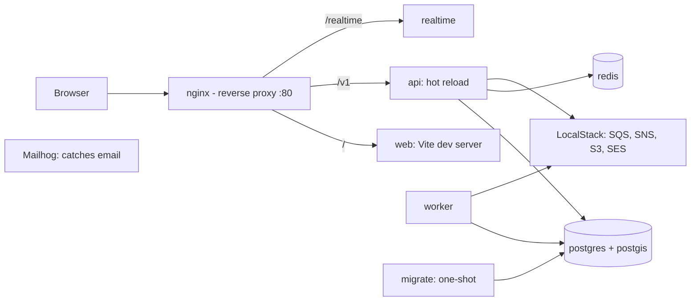
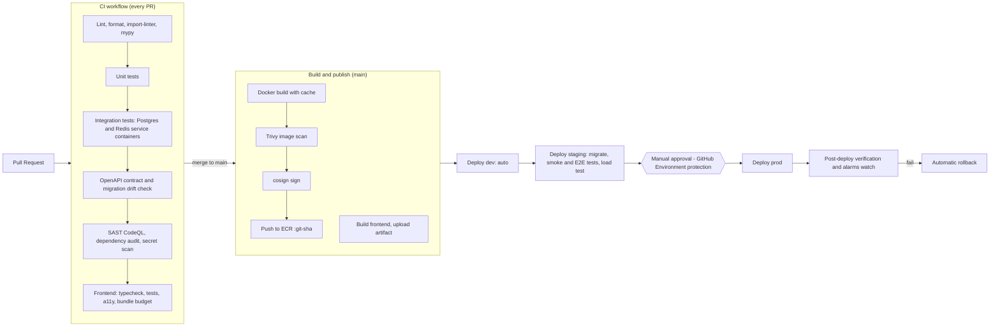
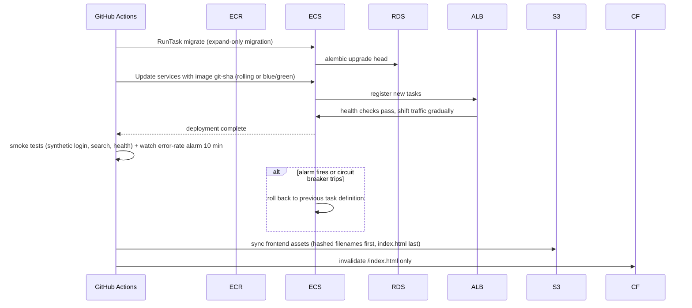
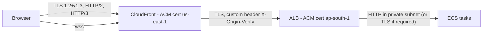
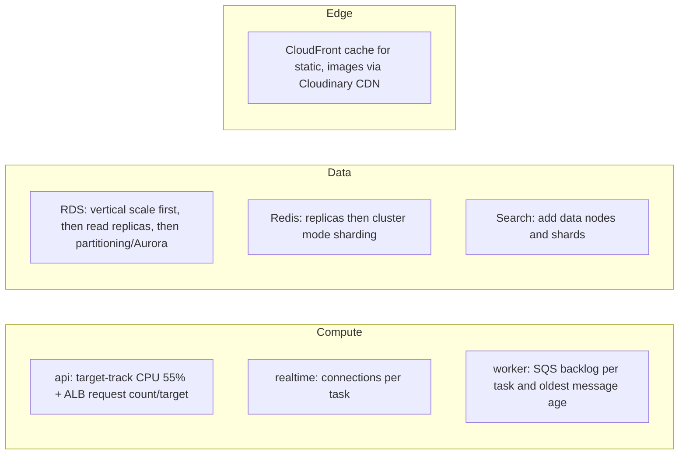
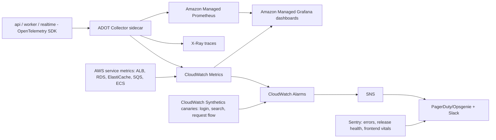
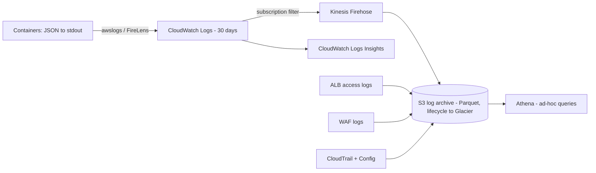
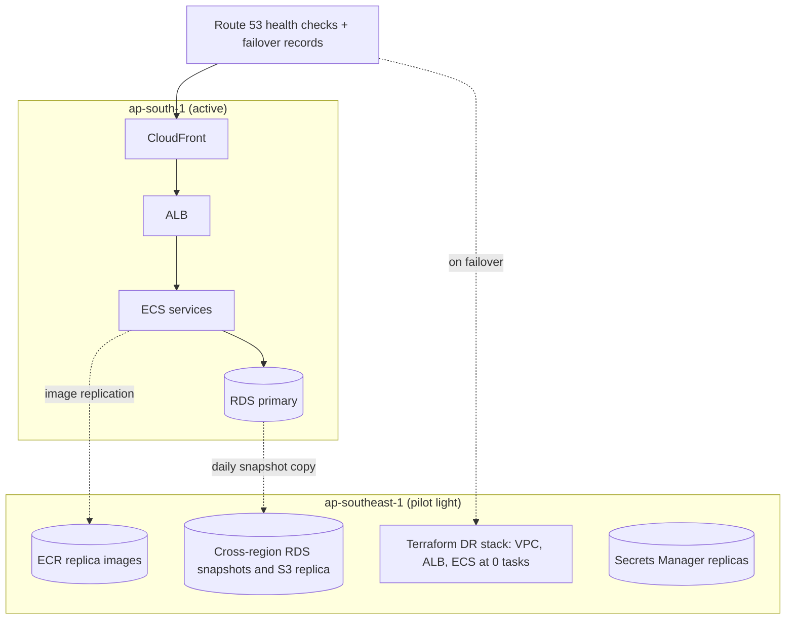

# BookBridge: Production Deployment Architecture

## 1. Deployment Principles and Key Decisions

| Decision | Choice | Why | Rejected |
| --- | --- | --- | --- |
| Compute | **ECS on Fargate** | No servers or clusters to patch, per-task autoscaling, containers stay portable to EKS later | EKS (control-plane cost and ops load for a small team), EC2 (patching/capacity management) |
| Images | One backend image, three entrypoints (api, worker, realtime) + a static frontend bundle | Same code path everywhere, single build/scan/sign pipeline | Separate repos/images per service: premature |
| Edge | **CloudFront + WAF + Route 53** in front of S3 (web app) and ALB (API) | One domain, TLS, DDoS and bot protection, caching for static and public GETs | Direct ALB exposure |
| Reverse proxy | **ALB is the production reverse proxy** (path routing, TLS termination, WebSocket, health checks). **Nginx only in local Docker Compose** to mimic routing | A managed layer-7 proxy removes a component to patch and scale | Nginx sidecar/fleet in prod: more moving parts for no gain |
| Database | **RDS PostgreSQL (Multi-AZ)** with PostGIS, upgrade path to Aurora | Managed backups, failover, patching. Start on RDS (cheaper), move to Aurora when read replicas/IOPS need it | Self-managed Postgres on EC2 |
| Cache | **ElastiCache Redis** (Multi-AZ replication group once traffic justifies) | Managed, in-VPC, low latency | Redis in a container (data loss, no failover) |
| Images/media | **Cloudinary** (required stack), behind the storage adapter; S3 for backups, exports, static assets | Transforms and CDN built in; adapter keeps S3 + CloudFront as a fallback | Hard vendor coupling |
| Search | **Phase 1: Postgres trigram/FTS behind the search adapter. Phase 2: Amazon OpenSearch** | OpenSearch is \~25% of baseline cost; unnecessary below \~100k listings, and the adapter makes the swap invisible | Provisioning OpenSearch on day one |
| IaC | **Terraform** (remote state in S3 + DynamoDB lock), modules per layer | Reproducible, reviewable, drift-detectable infrastructure | Click-ops, CloudFormation-only |
| Environments | **Separate AWS accounts** (dev, staging, prod) under AWS Organizations | Blast-radius and billing isolation, least-privilege IAM | Single account with tags |
| Release | Rolling/blue-green via ECS deployment circuit breaker with automatic rollback | Zero-downtime deploys, safe failure | Big-bang deploys |

## 2. Production Deployment Diagram

**Network design and why**

- **Three tiers of subnets:** public (ALB, NAT only), private-app (containers, no public IPs), isolated-data (no internet route at all). A compromised container cannot be reached directly, and databases cannot call out.
- **Security groups chain:** `ALB-SG → app-SG → data-SG` by security-group reference (not CIDR). Only the ALB accepts internet traffic (and in fact only from CloudFront using the managed prefix list plus a secret origin header).
- **VPC endpoints** for S3/ECR/SQS/Secrets keep AWS-bound traffic off the NAT gateway, which is both more secure and cheaper (NAT data processing is a common surprise cost).
- **3 AZs** so an AZ loss leaves 2/3 capacity, and the ALB and ECS rebalance automatically.

## 3. Environments

|  | Local | Dev | Staging | Production |
| --- | --- | --- | --- | --- |
| Purpose | Developer machine | Integration, per-PR previews optional | Production-like rehearsal, load tests, release candidate | Live |
| Runs on | Docker Compose | Small Fargate + tiny RDS | Same topology as prod, scaled down | Full topology |
| Data | Seed fixtures | Synthetic | **Anonymised** prod snapshot or synthetic | Real; PII encrypted |
| AWS account | none | `bb-dev` | `bb-staging` | `bb-prod` |
| Deploy trigger | manual | auto on merge to `main` | auto after dev green | manual approval after staging green |
| Multi-AZ / replicas | no | no | DB single-AZ | yes |

## 4. Docker Architecture

### 4.1 Images

| Practice | Why |
| --- | --- |
| **Multi-stage builds** | Final image has no compilers or build caches: smaller (≈150 MB), faster pulls (faster autoscaling), smaller attack surface |
| **Pinned base images by digest**, lockfile-based installs | Reproducible builds; protects against supply-chain drift |
| **Non-root user, read-only root filesystem, no shell in final stage, dropped Linux capabilities** | Limits exploit impact; Fargate task definitions enforce `readonlyRootFilesystem` with a small tmpfs |
| **One image, many commands** (`api`, `worker`, `realtime`, `migrate`) | The exact artifact tested in staging is what runs in prod; no divergence between API and worker code |
| **Tags:** immutable `git-sha` (deployed), plus moving `main`/`staging` for convenience; **never `latest` in task definitions** | Traceability and exact rollback |
| **ECR scan-on-push + Trivy in CI + image signing (cosign)** | Only scanned, signed images are deployable |
| **Healthcheck** (`/health/live`) and graceful shutdown (SIGTERM handling, 30 s drain) | ALB deregistration delay and in-flight requests/messages finish cleanly during deploys |
| **Process model:** 1 Uvicorn process per vCPU inside the container (Gunicorn with Uvicorn workers) | Fargate scales by task count, so keep containers small and uniform |
| **Frontend is not a container in prod** | Static files on S3 + CloudFront are cheaper, faster and more resilient than serving from compute |

### 4.2 Local development (Docker Compose)

Compose profiles: `core` (api, db, redis), `full` (+worker, realtime, localstack, mailhog, opensearch). `docker compose up` produces a working system with seed data, so parity with prod is high, and onboarding takes minutes.

### 4.3 ECS Task and Service Design

| Service | CPU / Mem (start) | Desired | Port | Notes |
| --- | --- | --- | --- | --- |
| **api** | 0.5 vCPU / 1 GB | 2 (min), max 20 | 8000 | Behind ALB target group `/v1/*` |
| **realtime** | 0.5 vCPU / 1 GB | 2, max 20 | 8001 | Target group `/realtime`, sticky not required (state in Redis), idle timeout 3600 s |
| **worker-default** | 0.5 vCPU / 1 GB | 1, max 15 | none | Notifications, indexing, trust |
| **worker-heavy** (later) | 1 vCPU / 2 GB | 0–5 | none | Image processing, exports; isolated so slow jobs do not starve reminders |
| **scheduler / migrate** | 0.25 vCPU / 512 MB | on-demand | none | EventBridge-triggered / pipeline-triggered RunTask |

Capacity: Fargate Spot for workers (interruption-tolerant thanks to SQS redelivery), on-demand for api/realtime. Task roles follow least privilege (api can publish to SNS but cannot read the backups bucket; worker can read SQS but not modify IAM, etc.).

## 5. CI/CD (GitHub Actions)

**Production release sequence (backward-compatible migrations, zero downtime)**

| Topic | Decision and why |
| --- | --- |
| **AWS auth from GitHub** | **OIDC federation** to per-environment IAM roles; no long-lived AWS keys in GitHub. Role trust is scoped to repo, branch and environment |
| **Branching** | Trunk-based: short-lived branches, PR checks required, `main` always deployable. Feature flags hide unfinished work |
| **Migrations** | Expand/contract: step 1 additive (new columns nullable, new tables, `CREATE INDEX CONCURRENTLY`), deploy code, step 2 backfill, step 3 contract in a later release. Old and new code both work against the intermediate schema, which makes rollbacks safe. A pre-deploy job takes a manual snapshot for risky migrations |
| **Deploy strategy** | Start with ECS **rolling update + deployment circuit breaker** (auto rollback). Move api to **CodeDeploy blue/green with canary 10% → 100%** once traffic justifies it |
| **Rollback** | Redeploy previous immutable `git-sha` task definition (minutes). DB changes are forward-compatible, so no schema rollback needed |
| **Frontend deploy** | Hashed assets are cached `immutable` for 1 year; `index.html` is `no-cache`; previous versions retained so open tabs do not break (chunk-load recovery handled in the app) |
| **Caching in CI** | Docker layer cache (GHA cache/ECR), pip and npm caches: cuts build time |
| **Gates** | Staging must pass E2E (5 golden journeys) + k6 smoke load before the prod approval button appears |
| **Supply chain** | Dependabot/Renovate, pinned actions by SHA, SBOM generated, signed images verified at deploy |
| **Terraform pipeline** | `plan` on PR (comment), `apply` on merge with approval; separate state per environment; drift detection nightly |
| **Notifications** | Deploy and failure events to Slack/email with commit, author, links |

## 6. Environment Variables

Injected into task definitions: non-secret values as plain `environment`, secrets as `secrets` (resolved from Secrets Manager/SSM at task start; never baked into images). Same variable names in all environments; only values differ.

| Group | Variable | Example / source | Secret? |
| --- | --- | --- | --- |
| **App** | `APP_ENV` | `production` | no |
|  | `APP_VERSION` | git sha (injected by CI) | no |
|  | `LOG_LEVEL` | `INFO` | no |
|  | `API_BASE_URL`, `WEB_BASE_URL` | `https://api.bookbridge.in` | no |
|  | `CORS_ALLOWED_ORIGINS` | `https://bookbridge.in` | no |
|  | `FEATURE_FLAGS_SOURCE` | AppConfig app/env id | no |
| **Database** | `DB_HOST`, `DB_PORT`, `DB_NAME`, `DB_USER` | RDS proxy/endpoint | no |
|  | `DB_PASSWORD` | Secrets Manager (rotated) | **yes** |
|  | `DB_POOL_SIZE`, `DB_MAX_OVERFLOW`, `DB_STATEMENT_TIMEOUT_MS` | `10`, `5`, `5000` | no |
|  | `DB_READ_REPLICA_HOST` | replica endpoint | no |
| **Redis** | `REDIS_URL` (TLS `rediss://`) | ElastiCache endpoint | no |
|  | `REDIS_AUTH_TOKEN` | Secrets Manager | **yes** |
| **Auth** | `JWT_ISSUER`, `JWT_AUDIENCE`, `JWT_ACCESS_TTL_SECONDS` | `900` | no |
|  | `JWT_PRIVATE_KEY_PEM` + `JWT_KEY_ID` (current), `JWT_PUBLIC_KEYS_JWKS` (all valid) | Secrets Manager | **yes** (private) |
|  | `PASSWORD_PEPPER` | Secrets Manager | **yes** |
|  | `GOOGLE_CLIENT_ID` | OAuth client | no |
|  | `GOOGLE_CLIENT_SECRET` | only if server-side flow is added | **yes** |
| **Messaging** | `SNS_EVENTS_TOPIC_ARN`, `SQS_QUEUE_URL_*` | Terraform outputs | no |
| **Storage** | `CLOUDINARY_CLOUD_NAME` |  | no |
|  | `CLOUDINARY_API_KEY`, `CLOUDINARY_API_SECRET` | Secrets Manager | **yes** |
|  | `UPLOAD_MAX_BYTES`, `UPLOAD_ALLOWED_MIME` | `5242880` | no |
| **Email/Push** | `SES_FROM_ADDRESS`, `SES_REGION` |  | no |
|  | `FCM_SERVICE_ACCOUNT_JSON` | Secrets Manager | **yes** |
| **Search** | `SEARCH_BACKEND` (`postgres` \| `opensearch`), `OPENSEARCH_ENDPOINT` |  | no |
| **Rate limiting** | `RATE_LIMIT_DEFAULTS`, policy overrides | JSON in SSM | no |
| **External** | `ISBN_API_BASE`, `ISBN_API_KEY` |  | key is **yes** |
| **Observability** | `OTEL_EXPORTER_OTLP_ENDPOINT`, `OTEL_SERVICE_NAME`, `OTEL_TRACES_SAMPLER_ARG` | `0.1` | no |
|  | `SENTRY_DSN` |  | **yes** (treat as secret) |
| **Frontend (runtime `config.json`)** | `apiBaseUrl`, `wsUrl`, `googleClientId`, `sentryDsnPublic`, `flags` | Generated at deploy per environment | no (public by nature) |

**Rules:** all config is validated at startup (missing or malformed → container exits, deployment circuit breaker rolls back); no secrets in `NEXT_PUBLIC`-style build-time frontend variables; one config schema shared by api/worker/realtime.

## 7. Secrets Management

| Concern | Approach |
| --- | --- |
| **Store** | AWS Secrets Manager for credentials needing rotation (DB, Redis token, JWT keys, third-party API secrets); SSM Parameter Store (SecureString) for lower-risk config. Encrypted with customer-managed KMS keys per environment |
| **Delivery** | ECS injects secrets as environment variables at task start via the **execution role**; the application role has no Secrets Manager read access beyond what it needs |
| **Rotation** | DB password: automatic 30-day rotation (Lambda rotation, apps reconnect via short pool recycle or RDS Proxy). JWT signing keys: publish new key in JWKS first → switch `kid` → retire old after max token + refresh lifetime. Third-party keys: quarterly manual with runbook |
| **GitHub** | No AWS keys (OIDC). Few remaining secrets (e.g. Slack webhook, Codecov) live in GitHub **Environment secrets** with required reviewers for prod |
| **Developer access** | No standing prod access; time-limited access via AWS IAM Identity Center (SSO) with MFA, all session activity in CloudTrail |
| **Leak prevention** | Secret scanning + push protection on the repo; `.env` files git-ignored; logs scrub secret patterns; pre-commit hook |
| **Break-glass** | Documented emergency role requiring two approvals; alarms on every use |
| **Incident response** | If a secret leaks: rotate, invalidate sessions (JWT key rotation + refresh token revocation), audit CloudTrail |

## 8. HTTPS, DNS and Reverse Proxy

| Topic | Decision |
| --- | --- |
| **Domains** | `bookbridge.in` (web), `api.bookbridge.in` (API + WebSocket), `cdn`/`img` handled by Cloudinary, `staging.` and `dev.` subdomains. Managed in Route 53 with alias records |
| **Certificates** | AWS Certificate Manager public certs with DNS validation and **automatic renewal**; CloudFront cert in `us-east-1`, ALB cert in the region |
| **TLS policy** | Minimum TLS 1.2 (prefer 1.3) using AWS-recommended security policy; HSTS (`max-age=31536000; includeSubDomains; preload`) set at CloudFront response-headers policy; HTTP redirects to HTTPS |
| **Origin lock-down** | ALB security group allows only CloudFront's managed prefix list, plus a secret header check in an ALB listener rule, so nobody can bypass WAF by hitting the ALB directly |
| **Reverse proxy / routing (ALB)** | Listener rules: `/v1/*` → api target group; `/realtime` → realtime target group (WebSocket upgrade supported; idle timeout 1 hour); `/health/*` blocked from the internet; default 404. Forwarded headers (`X-Forwarded-For/Proto`) are trusted only from the ALB (Uvicorn `--forwarded-allow-ips` set to the VPC CIDR) |
| **CloudFront behaviours** | `/` and static paths → S3 origin (OAC, long cache); `/v1/*` → ALB (caching disabled by default; \`GET /v1/genres |
| **Security headers** | CSP, `X-Content-Type-Options`, `Referrer-Policy`, `Permissions-Policy` via CloudFront policy; CORS handled by the API with a strict allow-list |
| **WAF** | AWS managed rule groups (Common, Known Bad Inputs, SQLi, IP reputation), Bot Control (targeted on auth routes), **rate-based rules** (e.g. 2,000 req/5 min per IP; 100 req/5 min on `/v1/auth/*`) as the outermost layer of the layered rate limiting design |

## 9. Load Balancing

| Aspect | Design |
| --- | --- |
| **Type** | Internet-facing Application Load Balancer (L7) across 3 AZs, cross-zone enabled |
| **Target groups** | `api-tg` (HTTP:8000, `/health/ready`), `realtime-tg` (HTTP:8001). IP targets (Fargate `awsvpc`) |
| **Health checks** | 15 s interval, 2 healthy / 3 unhealthy thresholds; readiness endpoint checks DB and Redis, so a task that lost its dependencies leaves rotation |
| **Algorithm** | Least outstanding requests (better than round-robin for variable-latency API calls) |
| **Draining** | Deregistration delay 30 s matched with app graceful shutdown |
| **Slow start** | 30–60 s warm-up for new tasks (connection pools, caches fill) |
| **WebSockets** | No stickiness required: connection state and fan-out in Redis pub/sub; reconnect with ticket + `after=` catch-up (per API design) |
| **Access logs** | To S3 (Athena-queryable) for forensics |
| **Internal traffic** | Services do not call each other through the ALB (single monolith + events), so no internal LB / service mesh is needed. Cloud Map or Service Connect is added only on service extraction |

## 10. Scaling Strategy

| Layer | Trigger and action | Notes |
| --- | --- | --- |
| **API** | Target tracking on CPU (55%) and `RequestCountPerTarget`; scale-out fast (1 min), scale-in slow (10 min cooldown); min 2 for AZ resilience; scheduled scale-up for known peaks (semester start, exam season) | Containers are stateless, so scale is linear until the DB is the bottleneck |
| **Realtime** | Custom metric: active WebSocket connections per task (target ≈ 5k) | Memory-bound; separate service so chat load cannot starve REST |
| **Workers** | Step scaling on `ApproximateNumberOfMessages / running tasks` and **oldest message age** (alarm if > 2 min) | Spot capacity; per-queue pools |
| **PostgreSQL** | 1) RDS Proxy (connection pooling, failover smoothing, essential once task count grows) 2) Right-size instance and provisioned IOPS 3) **Read replicas** for search fallback, profiles, dashboards (app routes read-your-writes-sensitive calls to primary) 4) Partition large append tables 5) Aurora and eventual regional sharding by city | Connection math: tasks × pool size must stay below `max_connections`; RDS Proxy absorbs spikes |
| **Redis** | Move to a replication group with replicas; cluster mode for sharding when memory or ops/sec require; eviction policy `allkeys-lru` for cache DB, separate logical instance for rate limiting/sessions that must not be evicted | Different data, different durability and eviction needs |
| **Search** | Postgres first; OpenSearch 3-node zone-aware cluster when listings exceed \~100k or p95 search latency regresses; add shards/nodes with data growth | Adapter pattern makes the switch a config change plus backfill |
| **Images** | Cloudinary CDN absorbs read load; our traffic is only signed upload and metadata | Watch Cloudinary credits (storage/bandwidth/transformations) |
| **Capacity planning** | Quarterly load tests (k6) in staging at 3× expected peak; track headroom SLO; Service Quotas reviewed in advance (Fargate vCPU, ENIs, ALB LCUs) | Quotas are a classic hidden scaling limit |

**Indicative sizing:**

| Stage | Users | API tasks | DB | Redis | Notes |
| --- | --- | --- | --- | --- | --- |
| Launch | \< 25k | 2 × 0.5 vCPU | db.t4g.medium Multi-AZ | cache.t4g.small | Postgres search |
| Growth | \~250k | 4–8 × 1 vCPU | db.m6g.large Multi-AZ + 1 replica, RDS Proxy | cache.m6g.large + replica | + OpenSearch |
| Scale | 1M+ | 10–30 × 1 vCPU | db.r6g.xlarge+ / Aurora, 2+ replicas | clustered | + dedicated realtime fleet, Kafka evaluation |

## 11. Monitoring and Alerting

| Category | Signals | Alert (illustrative) |
| --- | --- | --- |
| **SLOs (user-facing)** | Availability 99.9%, search p95 \< 300 ms, API p95 \< 200 ms (reads), error rate \< 0.5% | **Multi-window burn-rate alerts** on the error budget (page when fast burn, ticket when slow burn) |
| **API** | RED metrics per route template, 5xx rate, latency histograms | 5xx > 2% for 5 min → page |
| **ALB** | `HTTPCode_Target_5XX`, target response time, unhealthy hosts | Unhealthy hosts ≥ 1 for 5 min |
| **ECS** | CPU/memory, task restarts, deployment status | Restart loop; circuit breaker tripped |
| **Database** | CPU, freeable memory, connections, replica lag, deadlocks, slow queries (Performance Insights), storage autoscale | Connections > 80%; replica lag > 30 s; free storage \< 20% |
| **Redis** | Memory, evictions, CPU, replication lag | Evictions on the rate-limit/session store |
| **Queues** | Depth, **age of oldest message**, DLQ count | Any DLQ message → page; oldest age > 5 min |
| **Business** | Requests created, accept rate, completion funnel, signups, notification delivery | Sudden drop >40% vs same hour last week → investigate |
| **Security** | WAF blocked spikes, failed-login spikes, GuardDuty findings, root login, IAM changes | GuardDuty high-severity → page |
| **Synthetics** | Canaries every minute from multiple regions | 2 consecutive failures |
| **Cost** | AWS Budgets, anomaly detection | 80% / 100% forecast thresholds |

Each page links to a **runbook** (what it means, how to check, how to mitigate). On-call rotation, severity levels (SEV1–4), and blameless post-mortems are part of operating the system.

## 12. Logging

| Topic | Decision |
| --- | --- |
| **Format** | Structured JSON, one event per line, fields: `ts, level, service, env, version, request_id, user_id (hashed), route, status, latency_ms, event` |
| **Collection** | Containers write to stdout; ECS log driver (`awslogs`, or FireLens/Fluent Bit if routing is needed). No log files on disk, no agents inside app containers |
| **Retention** | CloudWatch 30 days (hot, searchable); S3 archive 13 months (compliance and forensics); security/audit logs (CloudTrail, `audit_logs` table exports) 7 years if required; Glacier lifecycle for cost |
| **PII/secrets** | Scrubbed at source (no tokens, passwords, full emails, message bodies); WAF logs redact authorization headers |
| **Correlation** | `request_id` propagated to events, workers and traces; logs link to X-Ray trace IDs |
| **Sampling** | INFO access logs are kept in full at launch; add sampling of successful reads if volume cost grows. Errors are never sampled |
| **Cost control** | Log levels by env (DEBUG only in dev), metric filters instead of storing high-volume noise, shorter hot retention, Firehose to S3 instead of long CloudWatch retention |
| **Access** | Read access by role; prod logs not accessible to every developer; queries audited |

## 13. Backups

| Asset | Mechanism | Frequency / retention | Verification |
| --- | --- | --- | --- |
| **PostgreSQL (RDS)** | Automated backups + **PITR** (continuous WAL), encrypted with KMS | 35-day retention; PITR granularity ≈ 5 min (RPO target ≤ 15 min) | **Monthly automated restore test** to a temp instance, run integrity queries and row-count checks |
|  | Manual snapshot before risky migrations and major releases | Kept 90 days | Tagged by release |
|  | Logical dump (`pg_dump`, critical reference/config tables) to S3 | Weekly | Guards against logical corruption beyond PITR window |
|  | **Cross-region snapshot copy** (Singapore) | Daily, 14 days | Restore drill in DR region (see §14) |
| **Redis** | Cache data is rebuildable, so no backup for cache. Session/rate-limit data is tolerant to loss. Daily snapshot for the durable-ish store only if introduced | 1–7 days | n/a |
| **Cloudinary (images)** | Cloudinary's storage durability + scheduled **backup of originals to S3** (Cloudinary auto-backup feature or periodic export) with S3 versioning | Continuous / weekly sync | Spot-check restore of random assets |
| **S3 buckets (exports, archives, frontend)** | Versioning + MFA delete on critical buckets, Object Lock for audit logs, CRR to DR region | Continuous | Lifecycle rules audited |
| **Infrastructure** | Terraform in Git (the repo *is* the backup); state bucket versioned with replica | Continuous | Rebuild test in a scratch account |
| **Secrets** | Secrets Manager multi-region replication for critical secrets | Continuous | Included in DR drill |
| **Search index** | Not backed up: rebuilt from Postgres via reindex script (outbox/CDC replay) | n/a | Reindex time measured quarterly |
| **Backup security** | Separate KMS keys, restricted IAM, deletion protection, alarm on backup failure |  |  |

## 14. Disaster Recovery

**Targets:** RPO ≤ 15 minutes · RTO ≤ 1 hour for regional failure; AZ failure is handled automatically (RTO ≈ 0–2 min).

| Failure | Detection | Response | RTO / RPO |
| --- | --- | --- | --- |
| Container/task crash | ECS health, ALB | Auto-replace | seconds / 0 |
| **AZ outage** | Alarms | Multi-AZ ALB, ECS spread across AZs, RDS Multi-AZ automatic failover (60–120 s), Redis Multi-AZ | ≈ 2 min / 0 |
| Bad deployment | Circuit breaker, burn-rate alarm | Automatic rollback to previous image | minutes / 0 |
| Data corruption / accidental delete | Reports, integrity checks | PITR restore to a new instance to just before the incident; selective data copy back | \< 1 h / ≤ 5 min |
| DB instance failure | RDS events | Failover to standby | ≈ 2 min / 0 |
| Redis loss | Alarm | Failover to replica / rebuild cold; app tolerates cache miss and re-warms | minutes / n/a |
| Third-party outage (Cloudinary, SES, Google) | Synthetics, circuit breakers | Graceful degradation: placeholder images, email retry via queue, email/password login still works | n/a |
| **Region outage** | Multiple alarms + AWS Health | **Pilot-light DR** in Singapore: invoke runbook (below) | ≤ 1 h / ≤ 15 min |
| Security incident (credential compromise) | GuardDuty, anomaly alerts | Isolate, rotate secrets/keys, revoke sessions, forensic review from CloudTrail | per runbook |

**Regional failover runbook (summary):** 1) Declare incident and freeze deploys. 2) Restore latest snapshot (or promote a cross-region read replica if enabled) in DR region. 3) Scale DR ECS services from 0 to target (images already replicated). 4) Point `api.` DNS (Route 53 failover/weighted) and update CloudFront origin; web assets are served from replicated S3. 5) Re-point SQS/SNS to DR resources (recreated by Terraform; in-flight events are re-derived from the `outbox_events` table). 6) Rebuild search index and warm cache. 7) Verify with synthetic checks. 8) Communicate status; post-mortem.

**Why pilot light, not active-active:** active-active doubles cost and introduces multi-region write conflicts that a startup does not need. Pilot light meets the RPO/RTO at a small fraction of the cost. An upgrade path to **warm standby** (cross-region read replica, minimum tasks running) exists when SLAs demand it.

**DR operations:** twice-yearly game days (simulated AZ failure, restore from backup, full DR failover), runbooks stored outside the primary region, and Chaos experiments (task kill, dependency latency) in staging.

## 15. Cost Optimization

### 15.1 Indicative monthly cost (ap-south-1, approximate)

| Component | Launch (\< 25k users) | Growth (\~250k) |
| --- | --- | --- |
| ECS Fargate (api, realtime, worker) | $60–90 (3–4 small tasks, workers on Spot) | $400–800 |
| ALB | $25–35 | $60–120 |
| RDS PostgreSQL (Multi-AZ) | $110–150 (db.t4g.medium) | $600–900 (m6g.large Multi-AZ + replica + Proxy) |
| ElastiCache Redis | $25–50 | $200–350 |
| NAT Gateway (single, with VPC endpoints) | $35–50 | $100–200 |
| OpenSearch | $0 (Postgres search) | $250–500 |
| CloudFront + WAF | $20–40 | $100–250 |
| S3, ECR, Route 53, SQS/SNS, SES | $15–30 | $60–150 |
| CloudWatch (logs, metrics, alarms), Managed Grafana | $30–60 | $200–400 |
| Cloudinary | Free/Plus tier ≈ $0–99 | $99–300 (usage-based) |
| **Approx. total** | **≈ $320–600 / month** | **≈ $2,000–4,000 / month** |

### 15.2 Levers (with reasoning)

| Lever | Saving | Trade-off |
| --- | --- | --- |
| **Defer OpenSearch** until needed (adapter-based) | Removes \~25–35% of baseline spend | Slightly less relevance tuning early |
| **Single-AZ dev/staging; staging scaled to zero at night/weekends** (scheduled ECS desired count 0, RDS stop) | 50–70% of non-prod cost | Cold start on morning |
| **Fargate Spot for workers** | \~70% on those tasks | Interruptions, which SQS redelivery tolerates |
| **Graviton (ARM) for Fargate, RDS, ElastiCache** | \~20% cheaper at equal performance | Build multi-arch images |
| **Compute Savings Plans / RDS & ElastiCache Reserved Instances (1-yr, no upfront)** after usage stabilises (\~month 4–6) | 25–40% | Commitment; buy for steady baseline only |
| **VPC endpoints instead of NAT for AWS traffic; one NAT in non-prod** | Avoids per-GB NAT charges | Endpoint hourly fees (still net cheaper at volume) |
| **Cache aggressively** (CloudFront for public GETs, Redis cache-aside, Cloudinary CDN) | Fewer compute/DB cycles | Invalidation discipline |
| **Image optimisation** (`f_auto,q_auto`, client-side compression before upload, max 6 images, 5 MB cap) | Cuts Cloudinary bandwidth/storage, the likely largest variable cost | Slight quality tradeoff |
| **Log cost control** (retention tiers, no DEBUG in prod, Firehose to S3 Parquet) | CloudWatch Logs ingestion can silently dominate bills | Slower access to old logs (Athena) |
| **Right-sizing from data** (Compute Optimizer, Performance Insights) monthly; autoscaling min = real baseline | 10–30% | Needs review habit |
| **S3 lifecycle** (Intelligent-Tiering, Glacier for archives) | Storage savings | Retrieval latency for cold data |
| **Budgets and anomaly detection**, cost-allocation tags (`env`, `service`, `team`) | Prevents surprises, per-service visibility | Tagging discipline (enforced in Terraform) |
| **Cost as an engineering metric** | Track cost per active user and per completed exchange |  |

*Rule of thumb:* never save money by removing Multi-AZ on prod DB, backups, or monitoring. These are the cheapest insurance in the architecture.

## 16. Production Readiness Checklist

- [ ] Multi-AZ everywhere in prod; autoscaling and alarms verified by load test
- [ ] Backups restored successfully at least once; DR runbook rehearsed
- [ ] WAF, TLS 1.2+, HSTS, origin lock-down in place
- [ ] No long-lived credentials; OIDC for CI; secrets rotated and scoped
- [ ] Dashboards, SLO burn-rate alerts, on-call and runbooks live
- [ ] Rollback tested; migrations are expand/contract
- [ ] Budgets, tags, and anomaly alerts enabled
- [ ] Data-protection obligations (DPDP): encryption at rest/in transit, deletion and export jobs, audit logs retained
- [ ] Penetration test / dependency review before public launch

## 17. Key Trade-offs

| Choice | Benefit | Cost accepted |
| --- | --- | --- |
| Fargate over EKS | Low ops burden | Less flexibility; fewer scheduling controls |
| Modular monolith, one image | Simple pipeline and deploys | A bug can affect all entrypoints until deploys are independent per service (mitigated by separate services/rollouts) |
| ALB as proxy (no Nginx) | Managed, scalable | Less custom routing logic than Nginx |
| Postgres search first | Cheap, simple | Must migrate to OpenSearch at scale |
| Pilot-light DR | Low cost, meets RPO/RTO | Manual-ish failover; \~1 h recovery |
| Single NAT in early stages | Saves \~$70/month | AZ-dependent egress risk (mitigated by endpoints; second NAT added at growth stage) |
| Cloudinary for media | Fast delivery, transforms, less code | Vendor cost at scale; mitigated by storage adapter and S3 backup of originals |